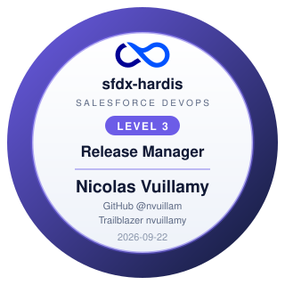

# Badges earned by Nicolas Vuillamy

GitHub: [@nvuillam](https://github.com/nvuillam)
 Trailblazer: [nvuillamy](https://www.salesforce.com/trailblazer/nvuillamy)

|                                                          | Badge                           | Awarded    | Verified     |
|----------------------------------------------------------|---------------------------------|------------|--------------|
|  | **sfdx-hardis Release Manager** | 2026-09-22 | 23/23 checks |

## What these mean

Each badge was awarded by a job that cloned [the repository](https://github.com/nvuillam/sfdx-hardis-training.git)
and re-ran every check of the level against its actual content and history. A level 2 badge also
re-ran the level 1 checks, and a level 3 badge re-ran all three.

What is verified is the work in the repository: the fields, the deployment actions, the resolved
conflicts, the pipeline configuration. What is **not** verified is the state of anybody's Salesforce
orgs. Nobody is asked for org credentials, and this is not an exam.

## It is a badge, not a certification

There is no exam and no accreditation here. Share this page under *Featured* on LinkedIn, or as a
course. Not under *Licenses & certifications*.

[Take the course](https://hardisgroupcom.github.io/sfdx-hardis-training/){ .md-button }
