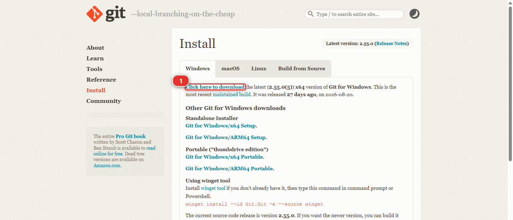
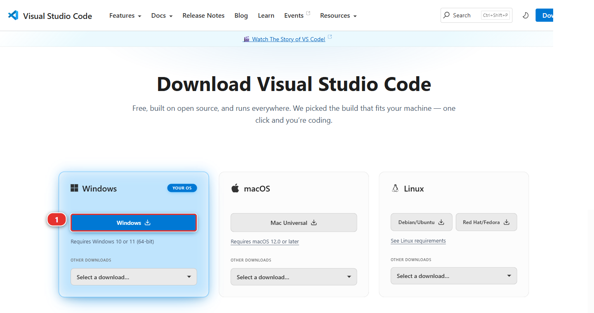
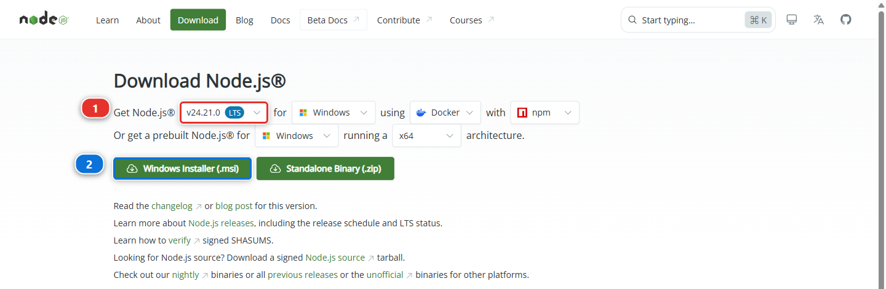
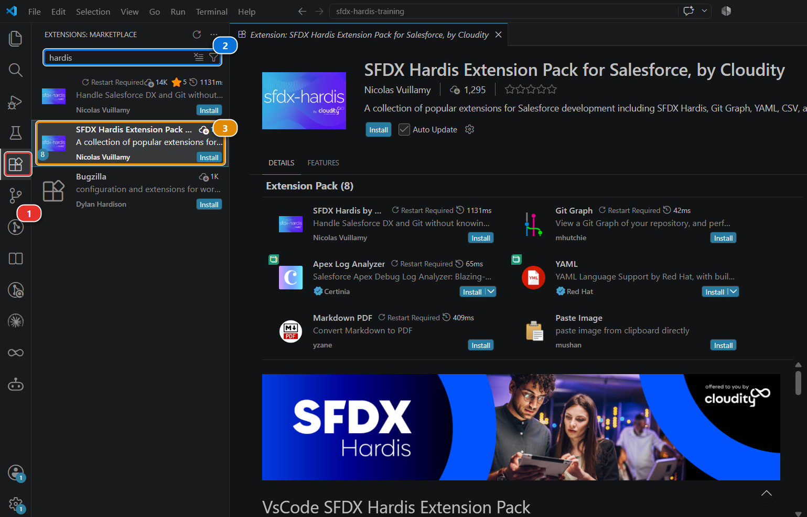
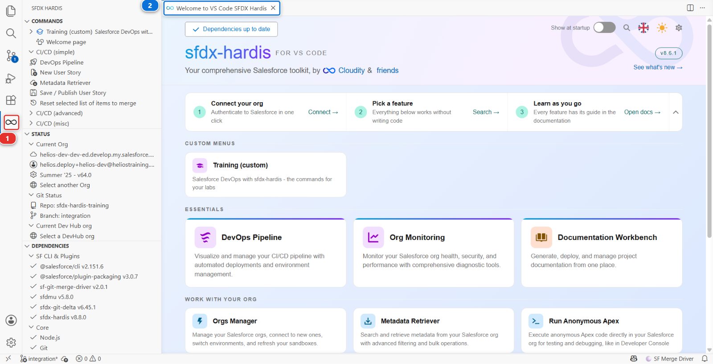
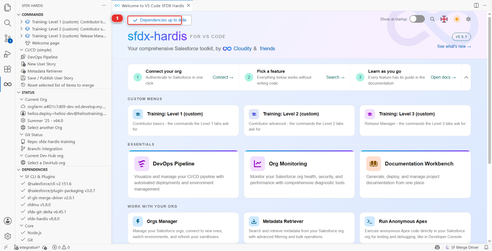
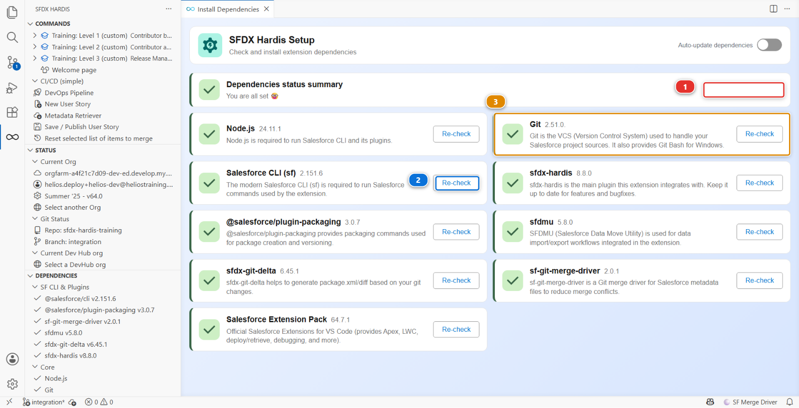
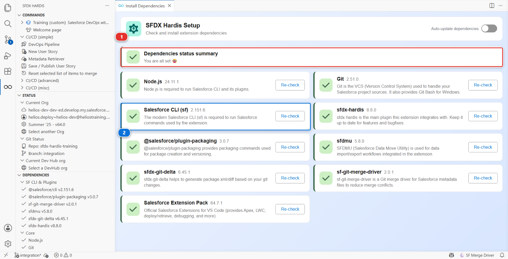

# Lab 0 - Install the tools

**Level**: 1 Contributor basics

**Time**: ~15 min

**You will**: turn a plain computer into one that can do Salesforce DevOps, without typing a single
command.

## The situation

Your first morning on any Salesforce team, this one or a real one. Before you can be given a ticket,
five things have to be on your machine, and the last of them installs most of the rest for you.

!!! tip "This lab stands on its own"
    It is the same list whether you are here for the course or joining a project that already has a
    pipeline, and it does not care which git provider that project uses: GitHub, GitLab, Azure
    DevOps and Bitbucket all work the same from here. If somebody sent you here to get set up
    before your first day, **finish this lab and stop**. Lab 1 is where the training-specific part
    starts: free Salesforce orgs, a training repository, fictional data. None of that belongs on a
    real project.

## Before you start

- [ ] A computer where you can install software, and permission to do so

## Steps

### 1. Install VS Code and the extension

First [Git](https://git-scm.com/downloads). Git is the tool that records every version of a project
and moves it between your laptop and wherever your team keeps the project, and everything else in
this course sits on it. You will
never have to type a Git command: the extension runs them for you, and shows you which one it ran.
The download page offers your operating system at the top: on Windows take **Click here to
download** **(1)**, the 64-bit standalone installer.

**Accept every default the installer offers**, and on Windows that matters more than it sounds. The
defaults include **Git Bash**, a Unix-style terminal that comes with Git, and sfdx-hardis uses it:
several of the commands the extension runs for you are shell commands that the Windows command
prompt does not understand. If you untick the Git Bash components, parts of this course fail with
errors that look like nothing to do with Git.

Two screens are worth reading rather than clicking through:

- **Select Components**: leave **Git Bash Here** and **Git GUI Here** ticked
- **Adjusting your PATH environment**: keep the recommended middle option, *Git from the command
  line and also from 3rd-party software*, so VS Code can find Git

macOS and Linux already have a Unix shell, so there is nothing to choose there.

!!! note "You may already have it"
    Plenty of machines do. Install it anyway: the installer recognises an existing Git and offers to
    update it. The Setup panel in step 2 checks it as well, and tells you if it is missing.

!!! tip "Checking Git Bash is there, on Windows"
    Right-click any folder: the menu should offer **Open Git Bash here**. In VS Code you will also
    find **Git Bash** in the terminal's dropdown, next to PowerShell. If neither shows up, run the
    Git installer again and keep the defaults this time.

Then open [Visual Studio Code](https://code.visualstudio.com/) and take the download for your machine.
On Windows that is the **Windows** button **(1)**; the two cards next to it hold the macOS and Linux
builds.

Then [Node.js](https://nodejs.org/), **version 22 at the least, 24 recommended**. Two things to
get right on that page:

1. the version selector **(1)**. The one marked **LTS** is the safe choice, as long as it reads 22
   or higher
2. **Windows Installer (.msi)** **(2)**, or the equivalent for your machine

Both are next-next-finish installers.

!!! warning "Restart VS Code after installing Git or Node.js"
    Both installers add themselves to the **PATH**, the list of places your machine looks for a
    command. A program only reads that list when it starts, so a VS Code that was already open when
    you installed them still cannot find them, and the Setup panel in step 2 reports them missing
    even though they are there. Close VS Code completely, windows and all, and open it again.

    The same applies to a terminal you already had open.

Then open VS Code and install the extensions. The **Extensions** icon **(1)** sits in the narrow bar
down the left, and looks like four small squares with one lifted away. Click it, type `hardis` in
the search box **(2)**, and click **Install** on **SFDX Hardis Extension Pack for Salesforce**
**(3)**, by Nicolas Vuillamy.

The pack installs sfdx-hardis itself along with the tools that go with it: Git Graph, which draws
your branches, the YAML and Markdown support the configuration files use, and the Apex log viewer.
Later levels use them, so take the pack rather than the single extension above it.

A new icon appears in the left bar **(1)**. Click it: the **Welcome** tab **(2)** opens, and that
tab is where every lab of this course starts.

### 2. Let the Setup panel install the rest

You need the Salesforce CLI and a few plugins. You are not going to install them by hand: the
extension has a panel that checks what is missing and installs it.

On the Welcome page, the button at the top left of the header band **(1)** opens the Setup panel.
There is no card called Setup: the button is labelled with the state of your dependencies, so it
reads **Check in progress** while it is still looking, then either **Dependencies up to date** or
**N update(s) needed**. Hover it and the tooltip says **Open Setup**. Wait for the check to finish,
then click it.

The panel lists every dependency the pipeline needs, with the version you have and the version
that is current:

1. **Salesforce CLI** - the `sf` command everything else runs on
2. **sfdx-hardis** - the plugin that adds the User Story commands
3. **SFDMU** - loads and extracts records, which is how your orgs get their data
4. **sfdx-git-delta** - computes what changed between two commits, used by the deployments
5. **Salesforce Extension Pack** - the official Salesforce tooling for VS Code

A dependency that is already fine is green and offers only **Re-check** **(3)**. One that is missing
or out of date carries its own **Upgrade** button **(2)**, and **Run pending installs** **(1)** does
the whole list in one go. Use that one: the panel queues the installations and reports each as it
finishes.

This takes a few minutes. It is the longest part of this lab and the only one you never repeat.

!!! warning "Restart VS Code once the installs are finished"
    The Salesforce CLI lands on the PATH as well, so the same rule applies: close VS Code and open
    it again before you carry on. Then press **Re-check** on the Setup panel. Anything that was
    still red for this reason turns green.

Under the hood: what the Setup panel just did

For each missing dependency it ran the plain npm command you would have run yourself, for example:

    npm install --global @salesforce/cli
    sf plugins install sfdx-hardis
    sf plugins install sfdmu
    sf plugins install sfdx-git-delta

then re-ran `sf version` and `sf plugins` and compared the answers with the versions published on
the npm registry. That comparison is the whole point of the panel: a pipeline breaks in confusing
ways when one person is two major versions behind, and nobody notices until a deployment fails.

## What you should see

The **Setup** panel with nothing left to install:

The line to read is the summary at the top **(1)**. It names anything still missing, and missing is
the only state that stops you. An amber **Upgrade** on a dependency **(2)** is not a failure: it
means a newer version exists, and the button fetches it whenever you feel like it.

Everything else is ticked, green, and at a version the panel is happy with.

That is the whole of this lab. Your machine can now run everything the rest of the course, and every
Salesforce project that uses sfdx-hardis, is going to ask of it.

## If it goes wrong

**The Setup panel says the Salesforce CLI is missing after it installed it.**
It landed somewhere that was not on the PATH of a terminal that was already open. Close VS Code
completely and open it again.

**The extension does not appear after installing it.**
Reload the window: **View > Command Palette**, then **Developer: Reload Window**.

**The Setup panel shows a red line you cannot clear.**
Click the line. The panel tells you what it tried and what it got back, and that message is nearly
always the answer.

## Next

If you came here to set up a real project, you are done: open your team's repository and the
**DevOps Pipeline** panel will tell you the rest.

If you are taking the course, Lab 1 builds you a small environment to work in: one free Salesforce
org, three scratch orgs created from it, a copy of the project, and a pipeline. It is the last of
the setup.

## Go deeper

- [Install sfdx-hardis](https://sfdx-hardis.cloudity.com/salesforce-devops-use-install/)
- [The VS Code extension](https://sfdx-hardis.cloudity.com/vscode-extension/)

[Next: Lab 1 - Set up your training environment](lab-01-fork-and-connect.md){ .md-button .md-button--primary }
