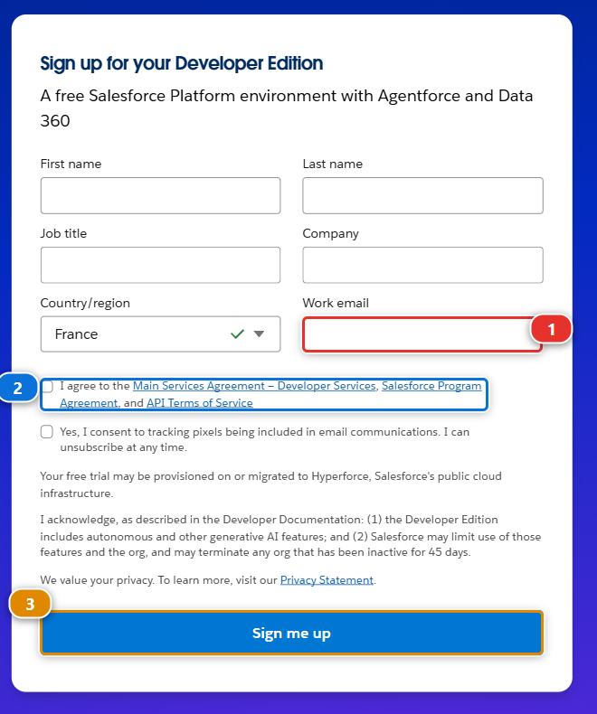
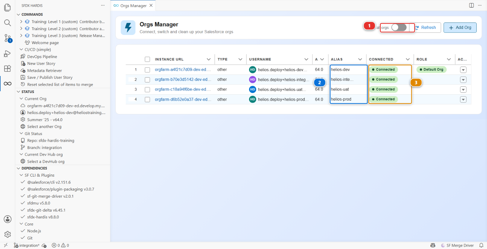
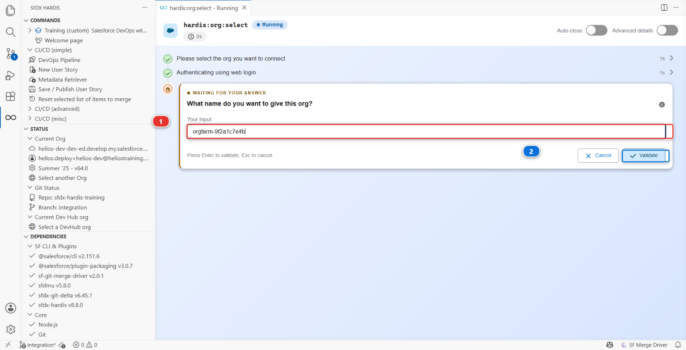
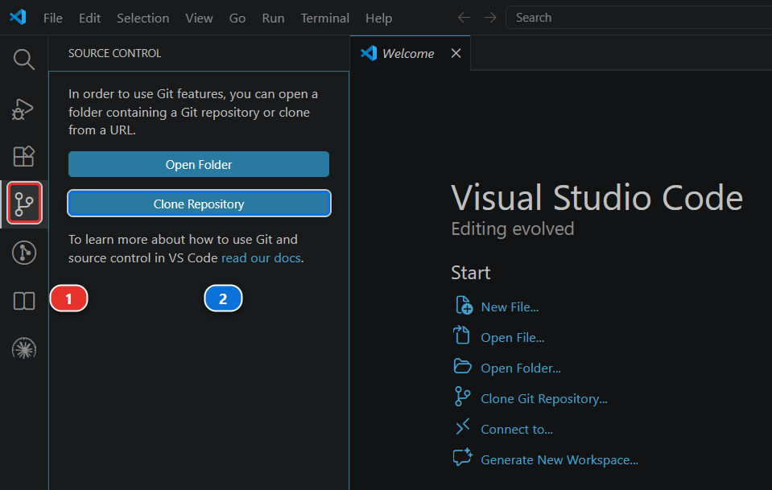
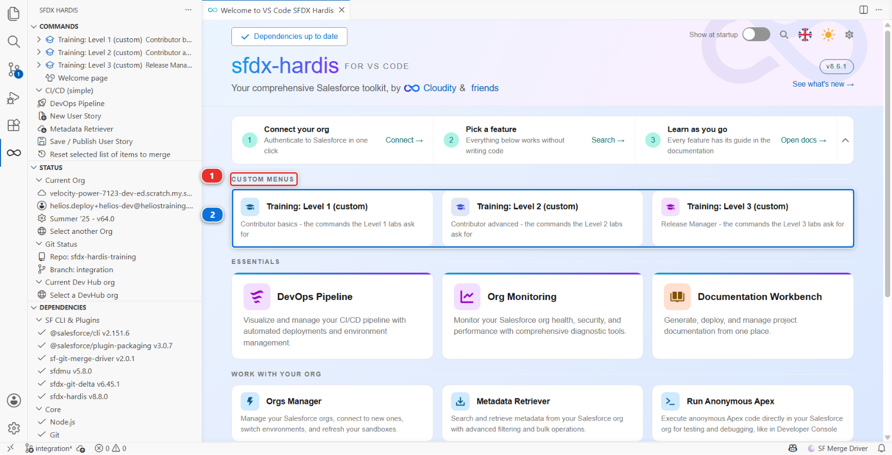
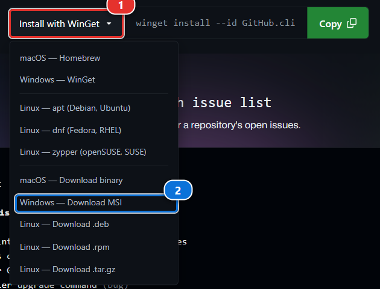
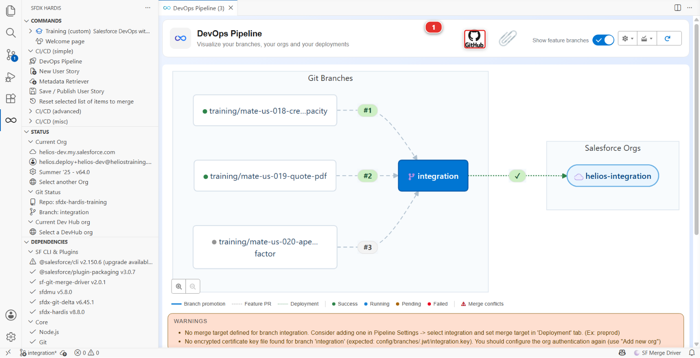
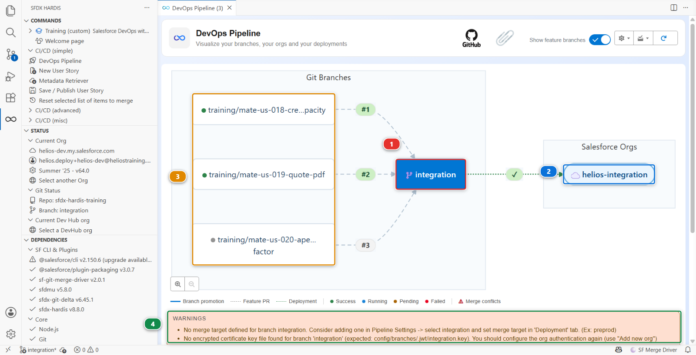

# Lab 1 - Set up your training environment

**Level**: 1 Contributor basics

**Time**: ~20 min

**You will**: end up with two Salesforce orgs of your own, a copy of the project, and a pipeline
wired to them.

## The situation

**This lab is not the job, and none of it happens on a real project.**

There, all of this exists before you arrive: the orgs were created by whoever set the project up,
the repository has been there for years, and its pipeline has been deploying for months. You would
join, open the project, and start on a ticket.

This course cannot hand you a team's environment, so it has you build a small one: two free
Salesforce orgs, a copy of the project, and a pipeline wired to them. Twenty minutes of plumbing,
once. The work starts in Lab 2, and everything from there on is what a real day looks like.

!!! note "This part is not what the job looks like"
    On a real project the repository already exists, its automation is already switched on and
    somebody set up the credentials once, months before you arrived. You would join, clone, and
    start on your first story. The setup below exists only because this course has to hand you a
    pipeline of your own, and it is worth ten minutes, once, rather than an afternoon.

## Before you start

- [ ] Lab 0 finished: the Setup panel all green
- [ ] A GitHub account
- [ ] Two working email addresses, or one address that supports plus-addressing

!!! info "If you do not have a GitHub account"
    Making one takes two minutes and costs nothing. Open
    [github.com/signup](https://github.com/signup) and give it an email address, a password and a
    username. GitHub emails you a code to confirm the address, and that is the whole of it: the free
    plan does everything this course needs, and it never asks for a card.

    Choose the username with a little care. It becomes part of the address of everything you put
    there, `github.com/<your-username>/sfdx-hardis-training` in a few minutes, and people do read
    it. Your name, or the handle you already use elsewhere, beats anything you will want to change
    later.

    **If you already have an account, use it.** Personal or work, old or new, it makes no
    difference here. The one thing worth knowing about a work account: some companies restrict what
    their members may fork. If the fork in step 5 is refused, that is why, and a personal account
    gets you past it.

- [ ] Nothing else. Step 5 installs the one extra tool it needs and signs you in with it

## Steps

### 1. Create your two Developer Edition orgs

Go to [developer.salesforce.com/signup](https://developer.salesforce.com/signup) and sign up
**twice**. Free, unlimited, no credit card.

The form asks for your first name, last name, job title, company and country or region, then three
things that decide whether the signup goes through:

1. **Work email** **(1)**
2. the tick that accepts the master subscription agreement **(2)**
3. **Sign me up** **(3)**



You do not choose a username: it is generated and sent to you.

**Work email** is the field that decides whether the second signup works. It must be a real
address you can open, because the signup is confirmed by email, and the two orgs cannot share one
address.

If you only have one, use plus-addressing. Everything between the `+` and the `@` is ignored on
delivery, so one inbox answers to as many addresses as you like. On Gmail, if your address is
`jane.doe@gmail.com`:

| Sign up with                  | The confirmation arrives in |
|-------------------------------|------------------------------|
| `jane.doe+heliosdev@gmail.com`   | `jane.doe@gmail.com`      |
| `jane.doe+heliosinteg@gmail.com` | `jane.doe@gmail.com`      |

Salesforce treats them as two different addresses, which is the point. Outlook.com, Fastmail,
iCloud and most company mail servers do the same; if yours does not, the confirmation simply never
arrives and you need a second real address.

Name them so you can tell them apart later:

| Org             | What it is for                                              |
|-----------------|-------------------------------------------------------------|
| your first org  | your own development environment, where you build           |
| your second org | the shared integration org, where the team's work is merged |

Open each confirmation email and set a password. The email also carries the username Salesforce
generated for that org: it looks like an email address but it is not one, and it is what you log in
with, what `sf org login` authenticates, and what you will type into the pipeline configuration in
step 2. Keep both usernames somewhere.

!!! note "A Developer Edition org never expires, but it is deactivated after a long period of inactivity. Finish a level within a few weeks and you will never meet that."

### 2. Connect both orgs in Orgs Manager

Back in VS Code, on the Welcome page, click **Orgs Manager**.



1. Click **Add Org** **(1)**, then pick **Connect to another org** in the list that opens
2. Leave the login URL on **Production / Developer Edition** (`login.salesforce.com`), because a
   Developer Edition org is not a sandbox
3. Your browser opens the Salesforce login page. Sign in with your first org, and allow access

Back in VS Code, the panel asks you one more thing:



**What name do you want to give this org?** The box **(1)** is already filled with a suggestion,
taken from the org's own web address. On a Developer Edition that address is a string Salesforce
invented, `orgfarm-9f2a1c7e4b` or similar, which tells you nothing about what the org is for.

**Replace it with `helios-dev`**, then click **Validate** **(2)**.

Repeat the whole thing for your second org, and name that one `helios-integration`.

That name is called an **alias**, and it is what you will see and click from now on: in this panel,
in the pipeline diagram, everywhere the course says "your dev org". Get these two right and nothing
else in the training is ambiguous.

Both orgs now appear in the table under the names you gave them **(2)**, with a green **Connected**
**(3)**. **This panel is how you connect to an org for the rest of the course.** Whenever a lab says
"connect an org" or "switch to an org", this is where you do it, and it is also how you check which
org you are pointed at, which saves more confusion than anything else in this training.

<details markdown="1"><summary>Under the hood: what connecting an org just did</summary>

The panel ran:

    sf hardis:org:select

which opened your browser, let Salesforce authenticate you, and stored an OAuth refresh token in
your user profile (`~/.sfdx`). Nothing is stored in the project, and nothing is committed: the
credential is yours and stays on your machine. Then it named the org:

    sf alias set helios-dev=you.helios.dev@heliostraining.invalid

The alias is the name everything else uses. Every sfdx-hardis command that wants an org accepts
`--target-org helios-dev` from now on, and so does the Salesforce CLI itself.

</details>

### 3. Get the repository

You need the training project on your machine before you can seed the orgs from it. Take the team's
copy for now: it is read-only, and step 5 turns it into your own in one command.

In VS Code, with no folder open, click the **Source Control** icon **(1)** in the narrow bar down the
left. It offers two buttons. Take **Clone Repository** **(2)**.



Then:

1. Paste `https://github.com/hardisgroupcom/sfdx-hardis-training.git` and press Enter
2. Pick the folder to put it in. VS Code creates a `sfdx-hardis-training` folder inside the one you
   choose, so choose the place you want **every** repository to live from now on. If you have no
   such place yet, make one: `C:\git` on Windows, `~/git` on macOS and Linux. Short path, no
   spaces, not inside OneDrive or any folder that syncs, because a sync client and a git repository
   fight over the same files
3. When it asks, click **Open** to work in the clone

If GitHub asks you to sign in, let VS Code handle it: **Sign in with your browser** is enough.

!!! note "You do not need an empty folder first"
    **Clone Repository** asks where to put the project, so there is nothing to prepare. The two
    buttons in the picture only appear while no folder is open: once one is, the Source Control
    panel shows that folder's changes instead.

<details markdown="1"><summary>Under the hood: what opening the folder told the extension</summary>

The extension read three files, and it reads them again whenever they change, so you never have to
reload the window:

- `sfdx-project.json`, which says the Salesforce sources live in `force-app`
- `config/.sfdx-hardis.yml`, the project configuration: major branches, cleaning rules, the
  Training menu
- `config/branches/.sfdx-hardis.integration.yml`, the branch configuration: which org the
  `integration` branch deploys to

That last one is empty of your details until step 5 fills it in.

</details>

### 4. Seed each org

Open the Welcome page again. Above the built-in cards there is a **CUSTOM MENUS** heading **(1)**,
holding a single card: **Training (custom)** **(2)**.



!!! note "Why the card says \"Training (custom)\""
    The extension appends `(custom)` to every menu a project declares in its own
    `config/.sfdx-hardis.yml`, so you can always tell a project's commands from the ones the
    product ships. The rest of these labs call it the **Training** menu.

Click it, then click **Set up one of my training orgs**.

The command asks which org. Pick `helios-dev`. It then:

1. Deploys an app called **Helios Delivery** into the org
2. Grants you the **Helios Delivery Manager** permission set
3. Loads 40 accounts, 60 contacts, 25 opportunities, 30 installations and 80 panel batches
4. Tells you what it put there

Run it a second time for `helios-integration`.

Helios Energy is the fictional company you are about to work for. Lab 2 introduces it properly, with
a backlog and a first ticket. For now it is just an app and some records, so that your orgs contain
something to change.

Each org takes a few minutes, most of it the metadata deployment. It is not stuck.

<details markdown="1"><summary>Under the hood: what "Set up one of my training orgs" just did</summary>

The card runs one command, declared by this project in `config/.sfdx-hardis.yml` under
`customCommands`:

    node scripts/training.mjs seed

which in turn runs three real commands against the org you picked:

    sf project deploy start --source-dir force-app --target-org helios-dev --wait 60
    sf org assign permset --name Helios_Delivery_Manager --target-org helios-dev
    sf hardis:org:data:import --path scripts/data/HeliosBaseline --target-org helios-dev

The order matters, and not in the way you would guess. A metadata deployment grants **no field
level security to anybody**, not even to a System Administrator. Load the data before assigning the
permission set and the load fails on fields the running user cannot see, with an error message that
says nothing about permissions. That is why step 2 sits between the deployment and the data.

The data load is an **upsert on an external id**, so running the card twice updates the same 235
records instead of creating 470. Anything in this course that can be run twice, can be run twice.

</details>

### 5. Set up your pipeline

One tool first, and only for this. The command below uses the
[GitHub CLI](https://cli.github.com/), called `gh`, to make your copy of the repository and set its
automation up. On its home page, open the install list **(1)** and take the download for your
machine: **Windows - Download MSI**, or **macOS - Download binary**. Accept the installer's defaults
**(2)**.



You never have to run `gh` yourself. The command below uses it once and signs you in through your
browser at that moment.

!!! note "This one is for the course, and for GitHub"
    It is here so that one click can hand you a working pipeline instead of a dozen forms. Nothing
    else in the course needs it, and nothing in sfdx-hardis does: this project happens to live on
    GitHub, and GitLab, Azure DevOps and Bitbucket projects work exactly the same way without it.
    On a real project you would join a repository that already exists, with its automation already
    running, and you would never install this.

Now, on the Welcome page, the **CUSTOM MENUS** heading **(1)** holds a single card, **Training
(custom)** **(2)**.


Click it, then click **Set up my pipeline**.

It asks one question, which of your orgs is the shared integration org, and then does four things
and tells you as it goes:

```text
1 of 4  Your own copy of the repository
OK  origin is now your-handle/sfdx-hardis-training, and the shared repository is upstream.

2 of 4  Actions turned on
OK  Actions are on.

3 of 4  Which org the integration branch deploys to
OK  config/branches/.sfdx-hardis.integration.yml now names your integration org.

4 of 4  The credential the CI job uses
OK  SFDX_AUTH_URL_INTEGRATION is set on your-handle/sfdx-hardis-training.
```

Running it twice is harmless: every step checks before it acts. If one of them cannot be done from
here, it says so and tells you which button to click instead.

### 6. What it just did

Four things, each of them real work on a real project, and none of them yours to repeat:

- **Your own copy of the repository**, its *fork*, under your GitHub account. Your clone pushes
  there now, and still pulls from the team's repository
- **Actions turned on.** GitHub disables workflows on every new fork until the owner says
  otherwise, and a fork with them off looks exactly like a broken course
- **Which org `integration` deploys to**, written into
  `config/branches/.sfdx-hardis.integration.yml` and pushed to your fork. The repository could not
  know that: your orgs did not exist when it was written. It is pushed because the badge job clones
  your fork and checks what is actually in it
- **A credential for the CI job**, as a repository secret named `SFDX_AUTH_URL_INTEGRATION`. The
  job runs on GitHub's machines, not yours, and cannot reach your org without one

!!! danger "About that credential, and why it is a deliberate exception"
    An SFDX auth URL embeds a **long-lived OAuth refresh token**. Anyone who reads it has your org
    until you revoke it, and it cannot be rotated without authenticating again. The sfdx-hardis
    documentation says plainly: [never use it for a major
    org](https://sfdx-hardis.cloudity.com/salesforce-devops-setup-auth/).

    That guidance is right, and it is about real major orgs. Here the org is a throwaway Developer
    Edition holding fictional solar installations, in a repository you own, for a course. The trade
    is: a beginner reaches a working pipeline in their first hour instead of their second day.

    **Level 3 lab 1 sets up JWT properly for all three orgs, and deletes this secret.** If you only
    ever do Levels 1 and 2, delete the secret and the orgs when you are done.

### 7. Let the extension talk to GitHub

The command you just ran used the GitHub CLI. The **extension** has its own connection to GitHub,
and it needs one too: without it the pipeline diagram can draw your branches but knows nothing about
your Pull Requests.

On the Welcome page, click **DevOps Pipeline**. At the top of the panel there is a **GitHub icon**
**(1)**. It is **grey** while the extension is not connected, and its tooltip reads **Connect to
GitHub**.



Click it. VS Code asks **How would you like to authenticate to GitHub?** and offers two answers:

- **Sign in with VS Code**, which opens your browser and is what you want here
- **Use Personal Access Token (PAT)**, for a host VS Code cannot sign in to, or an account you keep
  separate

Take **Sign in with VS Code** and approve the request in the browser. The icon turns from grey to
colour, its tooltip becomes **Connected to GitHub**, and the panel gains what it could not show
before: the Pull Requests on your branches, and the **Show feature branches** toggle.

### 8. Look at the pipeline before touching anything



This diagram is the single most useful thing in the extension. Read it left to right:

1. **`integration`** **(1)** is the only major branch this project has today. It is where every
   contributor merges, and it deploys to the integration org **(2)**
2. Your **feature branches** **(3)** appear as small boxes feeding into it
3. The **Pull Requests** waiting on it are the numbered badges on the arrows, coloured with their
   CI job status
4. **`uat`** and **`main`** exist as branches but are **not** part of the pipeline. Nobody wired
   them. That is not an accident: finishing this pipeline is what Level 3 is about

The branch you work on, and the org it ends up in, are the two facts that matter. Everything else
in this course is detail.

!!! note "About the two warnings at the bottom"
    The block at the bottom of the panel **(4)** warns that `integration` has no merge target, and
    that there is no certificate key file for it. Both are correct, and both are deliberate.

    The missing merge target is the missing rest of the pipeline: `uat` and `main` are not wired,
    and Level 3 lab 0 wires them. The missing certificate is the proper CI authentication, which
    Level 3 lab 1 sets up and which the secret from step 5 stands in for.

    A panel that tells you what is not finished is doing its job. Read these warnings on your own
    projects: they are usually right.

## What you should see

Back in the DevOps Pipeline panel, click **Refresh**. The `integration` column names your org under
the branch name, and the GitHub icon at the top is in colour. That link, branch to org, is what the
rest of this course rests on.

That is the whole of the plumbing, and the last of it you will see. From Lab 2 on you are doing the
job rather than preparing to do it: a ticket, a branch, a change, a Pull Request, a deployment.

## If it goes wrong

**Set up my pipeline says the GitHub CLI is not installed.**
Install it from [cli.github.com](https://cli.github.com/), as step 5 shows, then click the card
again. It signs you in itself, in your browser, the first time it needs to.

**It says Actions could not be turned on from here.**
GitHub hides that switch behind a banner with no API. Open the **Actions** tab of your fork and
click **I understand my workflows, go ahead and enable them**. One click, and the command has
nothing left to do.

**The Actions tab shows no workflows.**
You forked by hand at some point and left "Copy the `main` branch only" ticked, so your fork has no
`integration` branch. Delete the fork on GitHub and click **Set up my pipeline** again: it never
copies the default branch alone.

**The pipeline diagram is empty.**
The extension did not find `config/.sfdx-hardis.yml`. You opened the wrong folder: it must be the
root of the clone, the folder that directly contains `sfdx-project.json`.

**The pipeline shows branches but no Pull Requests.**
The extension is not connected to GitHub. That is step 7, and the icon at the top of the panel is
grey.

**VS Code cannot push and asks for credentials in a loop.**
Sign out of GitHub in VS Code (**Accounts** icon, bottom left) and sign in again with your browser.

## Check your work

Welcome page > **Training** > **Check my work**, then pick level 1 and lab 1.

## Go deeper

- [Clone the repository](https://sfdx-hardis.cloudity.com/salesforce-devops-clone-repository/)
- [Create a Git access token](https://sfdx-hardis.cloudity.com/salesforce-devops-git-tokens/)
- [GitHub Actions authentication](https://sfdx-hardis.cloudity.com/salesforce-devops-setup-auth-github/)

[Next: Lab 2 - Take US-014 from the backlog](lab-02-new-user-story.md){ .md-button .md-button--primary }
