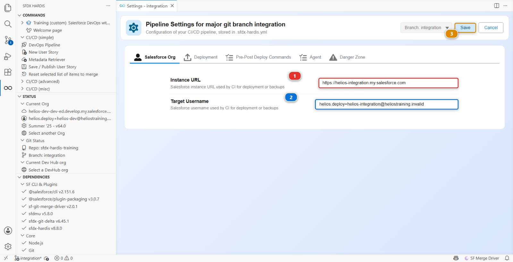

# Lab 1 - Set up your pipeline and read it

**Level**: 1 Contributor basics

**Time**: ~10 min

**You will**: turn the read-only clone from Lab 0 into your own working pipeline, then read the
diagram that tells you which branch deploys where.

## The situation

The Helios team keeps its whole project in one **repository** on GitHub: the Salesforce sources, the
configuration, the automation that deploys it, and every version of all of that since the project
started. Lab 0 put a copy of it on your machine, but a read-only one: you cannot push to the team's
repository and neither can anybody on this course.

So you need your own copy, called a **fork**, and it needs three things done to it before a Pull
Request opened there can deploy to an org you own. One command does all four.

!!! note "This part is not what the job looks like"
    On a real project the repository already exists, its automation is already switched on and
    somebody set up the credentials once, months before you arrived. You would join, clone, and
    start on your first story. The setup below exists only because this course has to hand you a
    pipeline of your own, and it is worth ten minutes, once, rather than an afternoon.

## Before you start

- [ ] Lab 0 finished: both orgs connected in **Orgs Manager** and seeded
- [ ] The training project open in VS Code, with the sfdx-hardis panel showing
- [ ] The GitHub CLI installed (Lab 0, step 1). You do not have to sign in: the command below
      does that for you, in your browser, the first time it needs to

## Steps

### 1. Set up your pipeline

On the Welcome page, the **CUSTOM MENUS** heading **(1)** holds a single card, **Training
(custom)** **(2)**.


Click it, then click **Set up my pipeline**.

It asks one question, which of your orgs is the shared integration org, and then does four things
and tells you as it goes:

```text
1 of 4  Your own copy of the repository
OK  origin is now your-handle/sfdx-hardis-training, and the shared repository is upstream.

2 of 4  Actions turned on
OK  Actions are on.

3 of 4  Which org the integration branch deploys to
OK  config/branches/.sfdx-hardis.integration.yml now names your integration org.

4 of 4  The credential the CI job uses
OK  SFDX_AUTH_URL_INTEGRATION is set on your-handle/sfdx-hardis-training.
```

Running it twice is harmless: every step checks before it acts. If one of them cannot be done from
here, it says so and tells you which button to click instead.

### 2. What it just did

Four things, each of them real work on a real project, and none of them yours to repeat:

- **Your own copy of the repository**, its *fork*, under your GitHub account. Your clone pushes
  there now, and still pulls from the team's repository
- **Actions turned on.** GitHub disables workflows on every new fork until the owner says
  otherwise, and a fork with them off looks exactly like a broken course
- **Which org `integration` deploys to**, written into
  `config/branches/.sfdx-hardis.integration.yml`. The repository could not know that: your orgs did
  not exist when it was written
- **A credential for the CI job**, as a repository secret named `SFDX_AUTH_URL_INTEGRATION`. The
  job runs on GitHub's machines, not yours, and cannot reach your org without one

!!! danger "About that credential, and why it is a deliberate exception"
    An SFDX auth URL embeds a **long-lived OAuth refresh token**. Anyone who reads it has your org
    until you revoke it, and it cannot be rotated without authenticating again. The sfdx-hardis
    documentation says plainly: [never use it for a major
    org](https://sfdx-hardis.cloudity.com/salesforce-devops-setup-auth/).

    That guidance is right, and it is about real major orgs. Here the org is a throwaway Developer
    Edition holding fictional solar installations, in a repository you own, for a course. The trade
    is: a beginner reaches a working pipeline in their first hour instead of their second day.

    **Level 3 lab 1 sets up JWT properly for all three orgs, and deletes this secret.** If you only
    ever do Levels 1 and 2, delete the secret and the orgs when you are done.

### 3. Let the extension talk to GitHub

The command you just ran used the GitHub CLI. The **extension** has its own connection to GitHub,
and it needs one too: without it the pipeline diagram can draw your branches but knows nothing about
your Pull Requests.

On the Welcome page, click **DevOps Pipeline**. At the top of the panel there is a **GitHub icon**
**(1)**. It is **grey** while the extension is not connected, and its tooltip reads **Connect to
GitHub**.


Click it. VS Code asks **How would you like to authenticate to GitHub?** and offers two answers:

- **Sign in with VS Code**, which opens your browser and is what you want here
- **Use Personal Access Token (PAT)**, for a host VS Code cannot sign in to, or an account you keep
  separate

Take **Sign in with VS Code** and approve the request in the browser. The icon turns from grey to
colour, its tooltip becomes **Connected to GitHub**, and the panel gains what it could not show
before: the Pull Requests on your branches, and the **Show feature branches** toggle.

### 4. Look at the pipeline before touching anything


This diagram is the single most useful thing in the extension. Read it left to right:

1. **`integration`** **(1)** is the only major branch this project has today. It is where every
   contributor merges, and it deploys to the integration org **(2)**
2. Your **feature branches** **(3)** appear as small boxes feeding into it
3. The **Pull Requests** waiting on it are the numbered badges on the arrows, coloured with their
   CI job status
4. **`uat`** and **`main`** exist as branches but are **not** part of the pipeline. Nobody wired
   them. That is not an accident: finishing this pipeline is what Level 3 is about

The branch you work on, and the org it ends up in, are the two facts that matter. Everything else
in this course is detail.

!!! note "About the two warnings at the bottom"
    The block at the bottom of the panel **(4)** warns that `integration` has no merge target, and
    that there is no certificate key file for it. Both are correct, and both are deliberate.

    The missing merge target is the missing rest of the pipeline: `uat` and `main` are not wired,
    and Level 3 lab 0 wires them. The missing certificate is the proper CI authentication, which
    Level 3 lab 1 sets up and which the secret from step 1 stands in for.

    A panel that tells you what is not finished is doing its job. Read these warnings on your own
    projects: they are usually right.

### 5. Find where the org setting lives, and change it

Step 1 wrote the branch configuration for you. Find it now anyway, because on a real project this is
the screen you use, and because you will need it again in Level 3.

In the DevOps Pipeline panel, open the gear menu at the top right **(1)** and choose
**Pipeline Settings**.


The settings are not per column: you pick the branch inside the panel, with the configuration scope
selector at the top **(1)**. Choose `integration`: the selector then reads **Branch: integration**,
and the title becomes **Pipeline Settings for major git branch integration**. The **Salesforce Org**
tab **(3)** shows the two values that were written for you.


The panel opens read-only, so nothing is changed by accident. Click **Edit** **(2)** and the card
becomes two fields:

1. **Instance URL** **(1)**, `https://login.salesforce.com` for a Developer Edition org, whatever
   its My Domain says
2. **Target Username** **(2)**, the org username, the one from the confirmation email
3. **Save** **(3)**, which writes the file



Check both against your integration org. If you are unsure of the username, open **Orgs Manager**:
it is the column next to the alias.

<details markdown="1"><summary>Under the hood: what the Settings screen writes</summary>

One file, `config/branches/.sfdx-hardis.integration.yml`:

    targetUsername: you.helios.integration@heliostraining.invalid
    instanceUrl: https://login.salesforce.com
    mergeTargets: []

sfdx-hardis has three layers of configuration, and this is the middle one:

| Layer   | File                                        | Who it applies to           |
|---------|---------------------------------------------|-----------------------------|
| project | `config/.sfdx-hardis.yml`                   | everyone, committed         |
| branch  | `config/branches/.sfdx-hardis.<branch>.yml` | one major branch, committed |
| user    | `config/user/.sfdx-hardis.<username>.yml`   | you only, git-ignored       |

A branch file is committed on purpose: on a real project, everybody has to agree on which org
`integration` means.

</details>

## What you should see

Back in the DevOps Pipeline panel, click **Refresh**. The `integration` column names your org under
the branch name, and the GitHub icon at the top is in colour. That link, branch to org, is what the
rest of this course rests on.

One thing left. The branch configuration is a file, and so far it only exists on your machine. Open
the **Source Control** panel, commit `config/branches/.sfdx-hardis.integration.yml` with the message
`Point integration at my org`, and push it to `integration`. It is the one time in this course you
commit straight to a major branch: from Lab 2 on, everything goes through a Pull Request.

It matters beyond tidiness. The badge job clones your fork and re-runs the checks against what is
actually in it, so a setting that never left your laptop counts as not done.

## If it goes wrong

**Set up my pipeline says the GitHub CLI is not installed.**
Install it from [cli.github.com](https://cli.github.com/), then run `gh auth login` and pick
GitHub.com, HTTPS, and authenticate with your browser. Lab 0 step 1 covers it.

**It says Actions could not be turned on from here.**
GitHub hides that switch behind a banner with no API. Open the **Actions** tab of your fork and
click **I understand my workflows, go ahead and enable them**. One click, and the command has
nothing left to do.

**The Actions tab shows no workflows.**
You forked by hand at some point and left "Copy the `main` branch only" ticked, so your fork has no
`integration` branch. Delete the fork on GitHub and click **Set up my pipeline** again: it never
copies the default branch alone.

**The pipeline diagram is empty.**
The extension did not find `config/.sfdx-hardis.yml`. You opened the wrong folder: it must be the
root of the clone, the folder that directly contains `sfdx-project.json`.

**The pipeline shows branches but no Pull Requests.**
The extension is not connected to GitHub. That is step 3, and the icon at the top of the panel is
grey.

**VS Code cannot push and asks for credentials in a loop.**
Sign out of GitHub in VS Code (**Accounts** icon, bottom left) and sign in again with your browser.

## Check your work

Welcome page > **Training** > **Check my work**, then pick level 1 and lab 1.

## Go deeper

- [Clone the repository](https://sfdx-hardis.cloudity.com/salesforce-devops-clone-repository/)
- [Create a Git access token](https://sfdx-hardis.cloudity.com/salesforce-devops-git-tokens/)
- [GitHub Actions authentication](https://sfdx-hardis.cloudity.com/salesforce-devops-setup-auth-github/)

[Next: Lab 2 - Take US-014 from the backlog](lab-02-new-user-story.md){ .md-button .md-button--primary }
