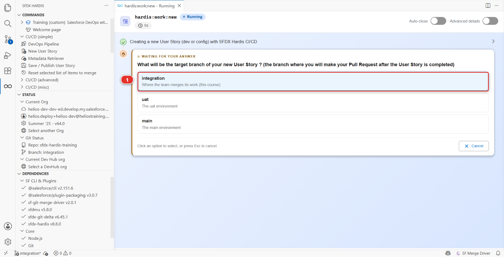
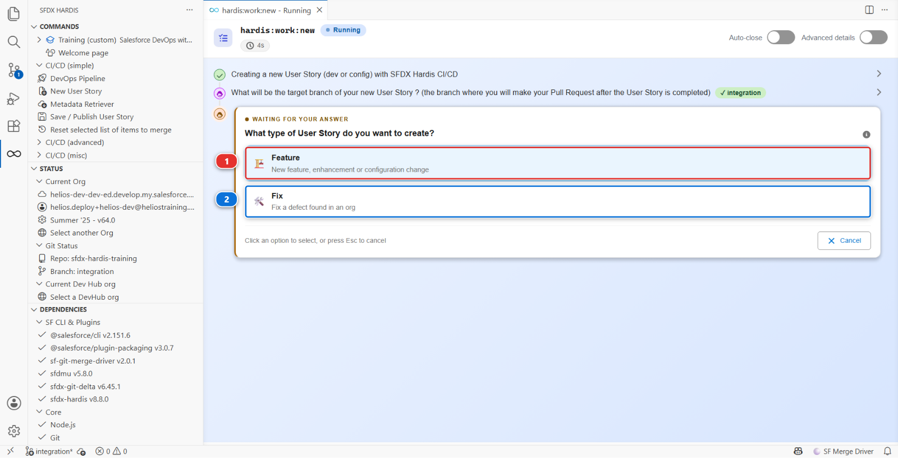
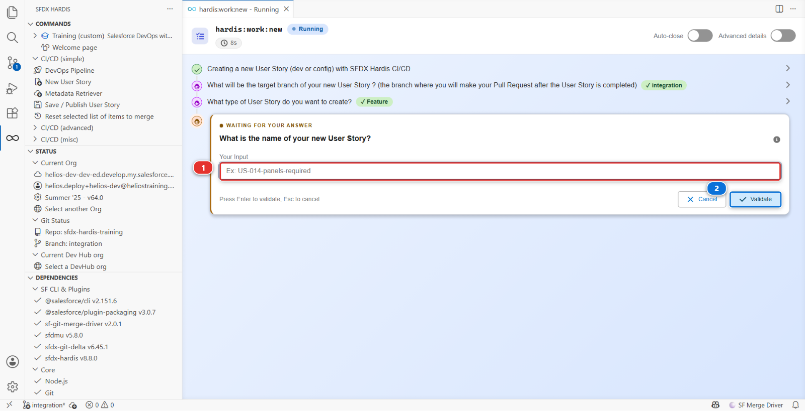
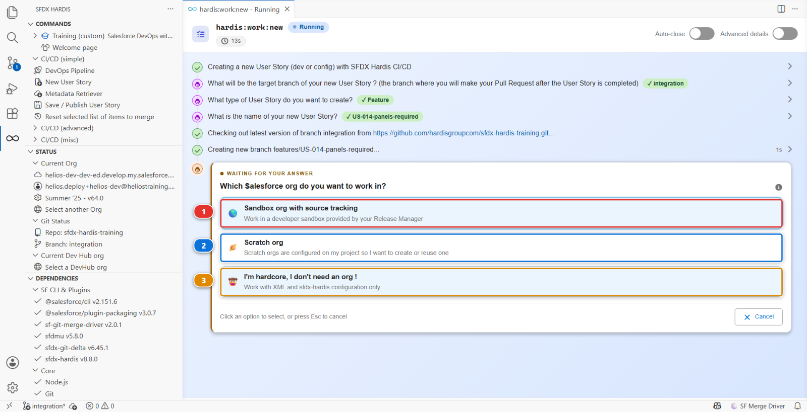
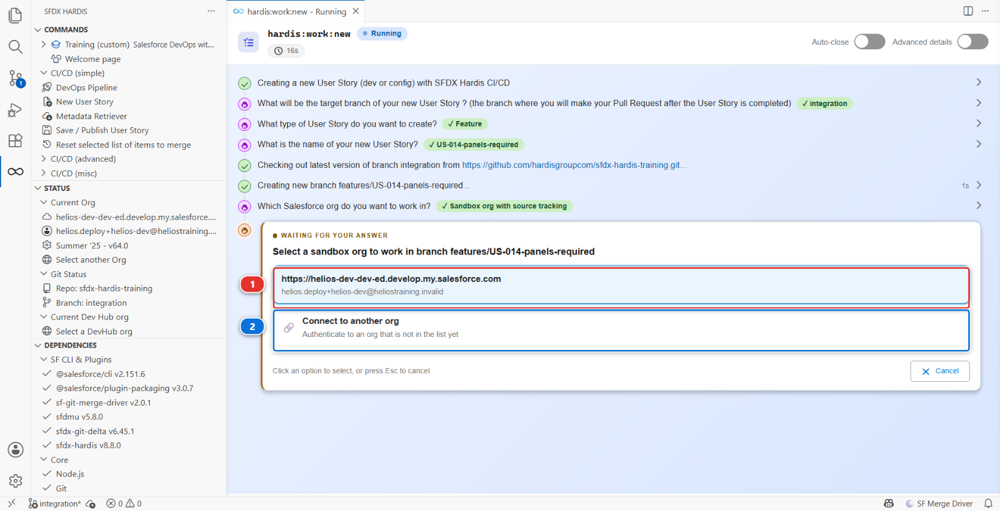
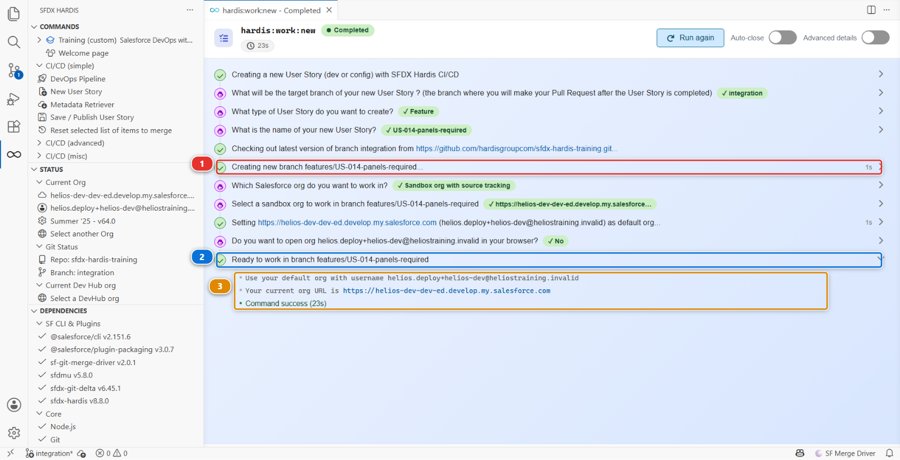

# Lab 2 - Take US-014 from the backlog

**Level**: 1 Contributor basics

**Time**: ~10 min

**You will**: pick up your first ticket and land on a clean branch, pointed at your dev org.

## The situation

The backlog is in [BACKLOG.md](../../../BACKLOG.md). Your first story is at the top:

> **US-014 - Show the crew how many panels a job needs**
>
> As a delivery crew member, I want to see the number of panels required on the installation
> record, so that I load the right quantity on the van.
>
> Acceptance criteria:
>
> - A Panels Required field exists on Installation
> - It is visible to the crew permission set
> - It appears on the Installation record page

Small on purpose. What matters in this lab is not the field, it is the loop you are about to learn
and repeat for the rest of your career on this project.

!!! info "Branch, in one sentence"
    A branch is a named line of work inside the repository. Yours starts as an exact copy of what
    the team has right now. You change what your story needs on it, and the team's version stays as
    it was until your Pull Request merges yours back in, which is how two people work on two stories
    at once without stepping on each other. The extension creates the branch, switches you onto it
    and later pushes it, so you never type a Git command.

## Before you start

- [ ] Lab 1 finished: your fork is cloned and `integration` names your org
- [ ] `helios-dev` connected in **Orgs Manager**

## Steps

### 1. Start the User Story

On the Welcome page, open the **DevOps Pipeline** panel and scroll past the diagram to the
**Project Contribution Workflow** **(1)**. Click the **New User Story** card **(2)**.


!!! tip "Cannot see the cards?"
    They sit under the branch diagram, and a project with several feature branches makes that
    diagram tall enough to push them off the screen. Turn **Show feature branches** off in the
    header: the diagram shrinks to the major branches and the cards come into view.

The extension asks four questions, one screen at a time. Each one appears in its own panel, and
every answer you give stays visible above the next question, so you can always see what you told it.

### 2. Where the work is going

**What will be the target branch of your new User Story?** Pick `integration` **(1)**, the one
described as where the team merges its work.



`uat` and `main` are under it and nothing is wired to them yet, which is why they are not offered.

You never guess where your work is going: the command asks first, writes the answer down, and every
later step reads it back.

### 3. What kind of work it is

**What type of User Story do you want to create?** Take **Feature** **(1)**: US-014 adds something
that was not there. **Fix** **(2)** is for correcting something already delivered.



The answer becomes the first part of your branch name, `features/` or `fixes/`, so anybody looking
at the list of branches can see at a glance what kind of work is in flight.

### 4. What to call it

**What is the name of your new User Story?** Type it in the box **(1)** and click **Validate**
**(2)**:

```
US-014-panels-required
```



The example under the field is not decoration: this project declares a pattern that names have to
match, and the example is a name that matches it. Type something else, `Panels Required` say, and
the command tells you what it expected and asks again.

### 5. Which org you will build in

**Which Salesforce org do you want to work in?** Take the first answer, **Sandbox org with source
tracking** **(1)**.



!!! info "Your org is not a sandbox, and the first answer is still the right one"
    That answer means "an org that already exists and that I will connect to", which is what you
    have. **Scratch org** **(2)** creates a throwaway org on the spot, which needs a Dev Hub this
    course does not use. **(3)** is for working on XML and configuration without an org at all.

Then the list of orgs. Pick the **first one** **(1)**, the one you gave the alias `helios-dev`.
**(2)** authenticates an org that is not in the list yet, which you do not need today.



This is the org you seeded in Lab 1, and the one you are about to change by hand in Setup. Never
pick `helios-integration` here: that is the shared org, and building directly in it is exactly what
this whole way of working exists to stop.

### 6. Read what it tells you at the end

The last question, *Do you want to open the org in your browser?*, is a convenience. Answer either
way: Lab 3 opens it from Orgs Manager.

Then the command finishes and prints what it did. Read it rather than closing it.



- the branch it created and checked out **(1)**
- the confirmation that you are ready to work on it **(2)**
- the org it attached to this User Story, by username and URL **(3)**

Those three lines are worth a glance every time. A branch name that is not the one you expected, or
an org that is not the one you meant, is a problem that costs thirty seconds now and an afternoon
later.

<details markdown="1"><summary>Under the hood: what "New User Story" just did</summary>

The panel ran:

    sf hardis:work:new

which did five things, in order:

1. **Fetched and updated the target branch.** `git fetch`, then `git checkout integration` and
   `git pull`, so your branch starts from what the team has now rather than from whatever you had
   last week. This is the step people skip by hand and regret a week later
2. **Created the branch**, named from your answers:
   `git checkout -b features/US-014-panels-required`
3. **Wrote your user configuration** in `config/user/.sfdx-hardis.<your-username>.yml`, recording
   the org for this User Story. That file is git-ignored: it is yours, nobody else needs it
4. **Selected the org** as the default target for the following commands
5. **Offered to refresh the org** with what is currently on `integration`, so you are not building
   on top of a stale org

The branch prefix `features/` and the name pattern come from `config/.sfdx-hardis.yml`:

    branchPrefixChoices:
      - value: features
        title: "Feature: a new capability or an improvement"
      - value: fixes
        title: "Fix: correct something that is broken"
    newTaskNameRegex: '^US-\d{3}-[a-z0-9-]+$'

Change those two settings and every contributor gets different prompts. That is how a project
enforces a convention without anybody having to remember it.

</details>

## What you should see

Three things, all visible without leaving VS Code:

1. **Bottom left of the status bar**: the branch is now `features/US-014-panels-required`
2. **The sfdx-hardis panel, Status section**: *Current Org* is your `helios-dev` org
3. **The DevOps Pipeline panel**: your new branch appears as a small box feeding `integration`

If any of the three disagrees with the others, stop and fix it now rather than after you have built
something.

## If it goes wrong

**The command refuses the name.**
The pattern this project uses is `US-014-panels-required`: three digits, then lowercase words
separated by hyphens. `US14-PanelsRequired` is rejected on purpose.

**It says you have uncommitted changes.**
You changed something before starting. Either commit it on the branch you are on, or discard it
from the Source Control panel. `hardis:work:new` will not carry stray work onto a fresh branch.

**The org list does not show `helios-dev`.**
It is not connected any more. Open **Orgs Manager** and reconnect it. Developer Edition sessions do
expire.

## Check your work

Welcome page > **Training** > **Check my work**, then pick level 1 and lab 2.

## Go deeper

- [Start a User Story](https://sfdx-hardis.cloudity.com/salesforce-devops-create-new-user-story/)
- [The contributor loop in one page](https://sfdx-hardis.cloudity.com/salesforce-devops-use-home/)

[Next: Lab 3 - Build it in your org](lab-03-build-in-org.md){ .md-button .md-button--primary }
