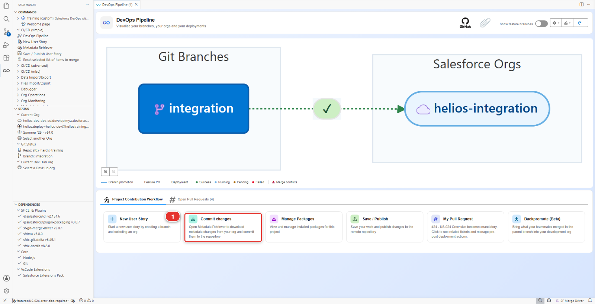
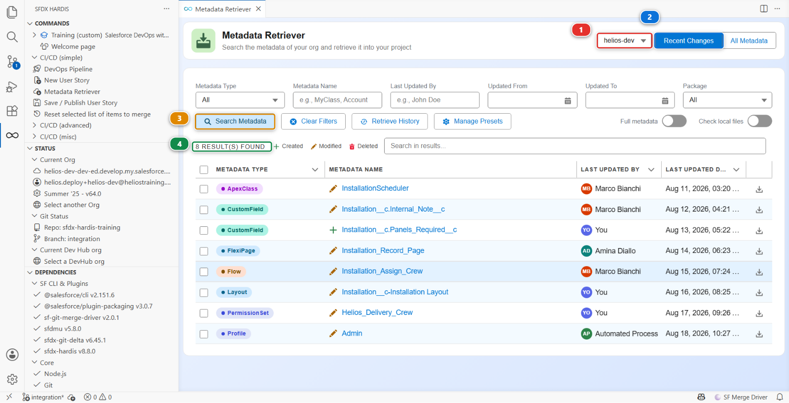
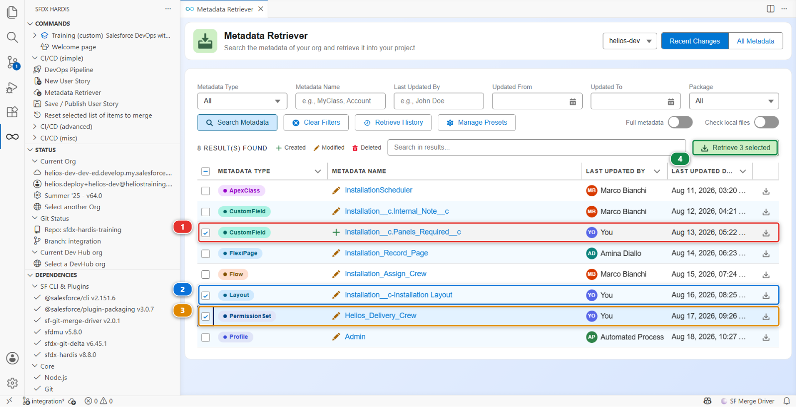
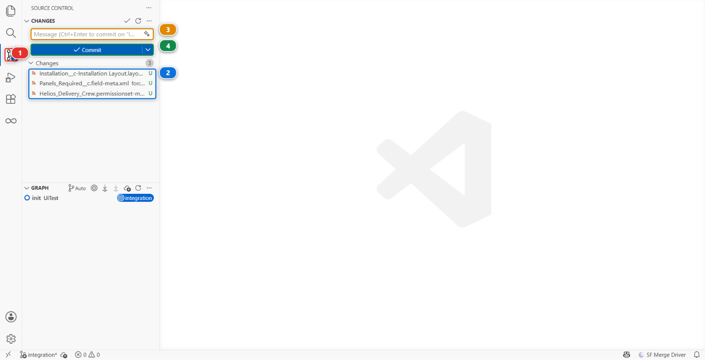
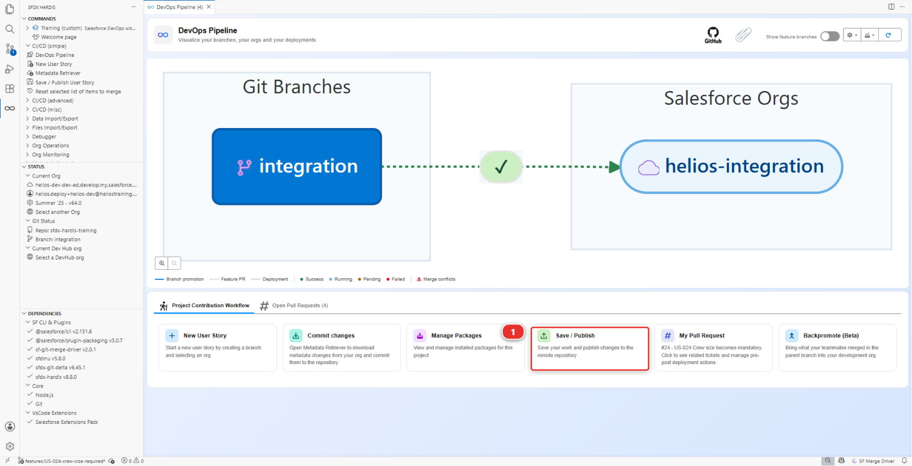
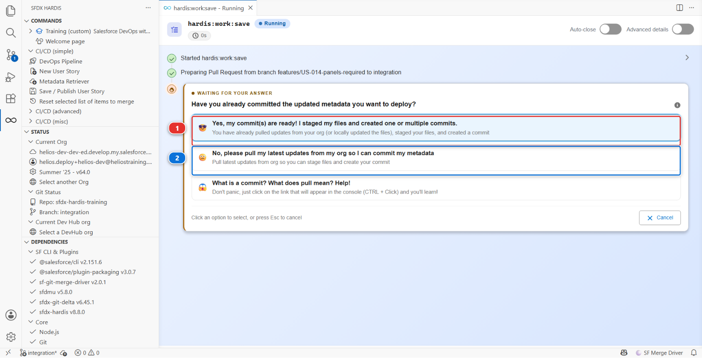
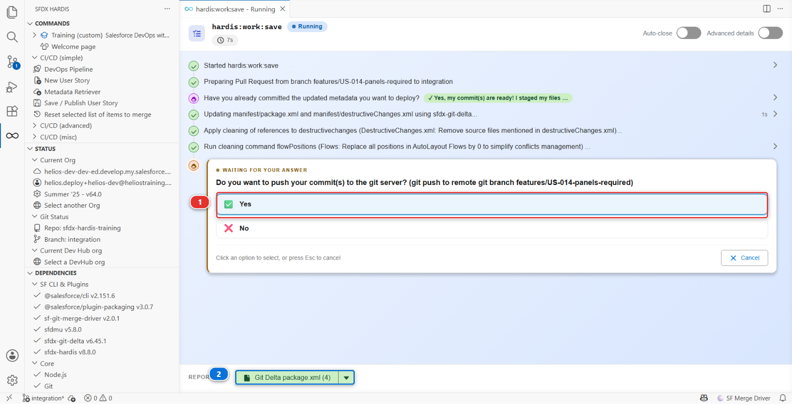

# Lab 4 - Choose what to keep, and publish it

**Level**: 1 Contributor basics

**Time**: ~20 min

**You will**: bring your org changes into the repository, decide which of them belong to your story,
and push a branch that is ready to be reviewed.

## The situation

Your field exists in one org. If your laptop died tonight, so would the story. Publishing is what
turns "it works in my org" into "the team has it".

This is the step where most of the thinking happens in a CI/CD project, and the one people rush.
Go slowly here once, and every following story takes five minutes.

## Before you start

- [ ] Lab 3 finished: the field exists in `helios-dev`, granted to the crew, on the layout
- [ ] You are still on `features/US-014-panels-required`

## Steps

### 1. Bring your changes out of the org

Your field is in Salesforce. Nothing of it is on your machine yet, and git only ever sees what is
on your machine.

In the **DevOps Pipeline** panel, under **Project Contribution Workflow**, click the **Commit
changes** card **(1)**.



It opens the **Metadata Retriever**, which is where every publish starts.

### 2. Ask the org what changed

Check the org **(1)** reads `helios-dev`, the org you built in. **Recent Changes** **(2)** is
already selected: it asks Salesforce what has been modified lately rather than listing the tens of
thousands of components an org contains. Click **Search Metadata** **(3)**.



A handful of results comes back **(4)**, each with what it is, its name, who last touched it and
when. Yours are the ones that say **You**.

!!! info "Why other people are in this list"
    You are alone in `helios-dev`, and the list still has rows you never touched. Some are
    Salesforce moving things on its own, some came from the last deployment into this org. That is
    normal, on every org, and it is exactly why the next step is a decision rather than a button.

### 3. Take yours, leave the rest

Tick three rows, and only three:

1. **CustomField** `Installation__c.Panels_Required__c` **(1)** - the field
2. **Layout** `Installation__c-Installation Layout` **(2)** - the placement
3. **PermissionSet** `Helios_Delivery_Crew` **(3)** - the grant

Then click **Retrieve 3 selected** **(4)**.



Two rules make that decision for you, and they are the whole of this lab:

- **If you did not mean to change it, it does not belong in your story.** Committing it makes your
  Pull Request about something other than US-014, and the reviewer cannot tell which part is yours
- **If you are not sure, leave it out.** Nothing is lost. It is still in your org, and you can
  publish it in a later story once you know what it is

The retriever writes those three components into `force-app/` as files. It changes nothing in
Salesforce and nothing on your branch yet.

### 4. Commit what came down

Open the **Source Control** panel **(1)**, the third icon in the left bar. The three files the
retrieve wrote are waiting there **(2)**.



Click each one and read the diff. It takes a minute and it is the last moment where a mistake is
free. Then type a message **(3)** and click **Commit** **(4)**.

Write the message for the person reviewing tomorrow, not for yourself today. First line short, then
a blank line, then why:

> US-014 Panels Required on Installation
>
> Adds Panels_Required__c on Installation__c so the crew knows how many panels to load.
> Read access granted on Helios_Delivery_Crew, field added to the Installation layout.

That text follows your branch everywhere: it is what the reviewer sees in the Pull Request, and it
is what anybody reading the history of this project in two years will find.

!!! tip "Nothing else must be in that list"
    If a fourth file appears that you did not retrieve, do not commit it. Right-click it and
    **Discard Changes**. A file you cannot explain is a file that does not belong in your story.

Your work is now in the repository, on your branch, on your machine. What is left is to prepare it
for the team, and that is what Save / Publish does.

### 5. Publish it

In the **DevOps Pipeline** panel, click the **Save / Publish** card **(1)**.



The first question is the one that catches everybody out.



Answer **(1)**, *My commits are ready*, because they are: you retrieved and committed in the steps
above. **(2)** asks the command to pull the org for you instead, and there is a third answer that
explains what a commit is, which costs nothing to read.

!!! warning "Why this course never takes answer (2)"
    That answer runs `sf project retrieve start`, which needs **source tracking**. Scratch orgs and
    source-tracked sandboxes have it. The free Developer Edition orgs this course uses, and plenty
    of real sandboxes, do not, and the command fails with an error about source tracking that reads
    like something is broken.

    The Metadata Retriever works on every org, which is why the whole course goes through it. Take
    the same route on a real project and you will never meet that error.

### 6. Read the manifest before you push

The command pauses before pushing and asks you to confirm **(1)**. Take the pause: this is the
last look you get at the package before it leaves your machine.

Open `manifest/package.xml` in VS Code, or open the **Deployment Packages** menu at the top of the
DevOps Pipeline panel and choose **Package XML**. The command hands it to you as well, as the
**Git Delta package.xml** report at the bottom of its own panel **(2)**, with the number of
components it holds.



It should say something close to:

```xml
<types>
    <members>Installation__c.Panels_Required__c</members>
    <name>CustomField</name>
</types>
<types>
    <members>Installation__c-Installation Layout</members>
    <name>Layout</name>
</types>
<types>
    <members>Helios_Delivery_Crew</members>
    <name>PermissionSet</name>
</types>
```

**This file is the contract.** It is the list of what will be deployed to the next org, and nothing
outside it travels. If a component you expected is missing here, it will be missing in integration
too, and the deployment will either fail or, worse, succeed while doing half of what you meant.

Reading this file before every push is the single habit that separates a contributor who has
trouble with deployments from one who does not.

### 7. Look at what the cleaning removed

Open the **Source Control** panel and look at the diff of
`force-app/main/default/permissionsets/Helios_Delivery_Crew.permissionset-meta.xml`.

You will see your `Panels_Required__c` grant added. You may also see things you never touched being
**removed**. That is automated cleaning, and it is deliberate.

<details markdown="1"><summary>Under the hood: what "Save / Publish" just did</summary>

The panel ran:

    sf hardis:work:save

which performed, in order:

1. **Generated `manifest/package.xml`** from the git diff between your branch and `integration`.
   Not from what you ticked in the retriever: from what your commits actually changed. Those are
   usually the same thing, and the minute you spend reading the file is the minute you find out
   when they are not
2. **Applied the cleaning rules** declared in `config/.sfdx-hardis.yml`:

        autoCleanTypes:
          - destructivechanges
          - localfields
          - productrequest
          - flowPositions
          - minimizeProfiles
          - listViewsMine

   `flowPositions` strips the pixel coordinates of flow elements, which change every time anybody
   opens a flow and produce conflicts that mean nothing. `minimizeProfiles` removes from Profiles
   everything that a Permission Set should carry. `listViewsMine` rewrites list view scopes that
   only make sense for the user who retrieved them

3. **Removed the user permissions** listed under `autoRemoveUserPermissions`, which are permissions
   this project has decided must never travel between orgs through a deployment
4. **Committed what it changed**, as `chore(sfdx-hardis): update package content` and
   `chore(sfdx-hardis): clean sfdx project`. Those commits are the tool's, not yours: yours is the
   one you wrote at step 4
5. **Pushed** the branch to your fork

Every one of those steps is configuration, not magic. Everything it did is in
`config/.sfdx-hardis.yml`, and a project that wants different behaviour changes that file.

</details>

### 8. Push

The command asks before it pushes: that is the question marked **(1)** in the picture at step 6.
Answer **Yes** and the branch goes to your fork. If you answered **No**, open the **Source Control**
panel and click **Publish Branch**.

## What you should see

- `manifest/package.xml` listing exactly your three components
- Your branch on GitHub, in your fork, under **Branches**
- The DevOps Pipeline panel showing your branch feeding `integration`, with no Pull Request yet

## If it goes wrong

**Recent Changes lists things I never touched.**
Normal on any org: Salesforce records a lot of internal churn, and the last deployment into this
org counts as a change too. Tick only your three. The **Last Updated By** column is the fastest
way to tell: yours say **You**.

**Recent Changes finds nothing at all.**
You are looking at the wrong org. Check the selector at the top right reads `helios-dev`, and that
the Status section of the sfdx-hardis panel agrees.

**`manifest/package.xml` is empty.**
You have no commit on this branch, so there is no difference for it to describe. Go back to step 4:
retrieving writes files, committing is what puts them on the branch.

**The permission set diff shows deletions you do not understand.**
That is `minimizeProfiles` and `autoRemoveUserPermissions` doing their job. Read the
`config/.sfdx-hardis.yml` block above. Nothing is lost in your org: cleaning changes what is
committed, never what is in Salesforce.

**Push is rejected.**
Your fork moved, usually because you reset a level. Pull first: Source Control panel, **...** menu,
**Pull**.

## Check your work

Welcome page > **Training** > **Check my work**, then pick level 1 and lab 4.

## Go deeper

- [Publish your User Story](https://sfdx-hardis.cloudity.com/salesforce-devops-publish-user-story/)
- [Automated sources cleaning](https://sfdx-hardis.cloudity.com/salesforce-devops-config-cleaning/)

[Next: Lab 5 - Open the Pull Request, get it green, merge](lab-05-pull-request.md){ .md-button .md-button--primary }
