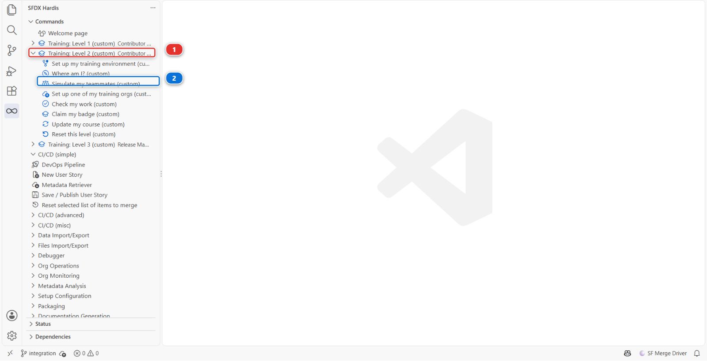
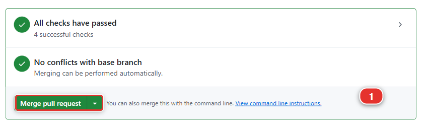
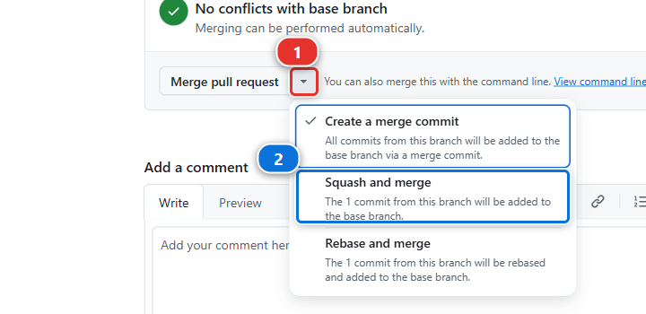
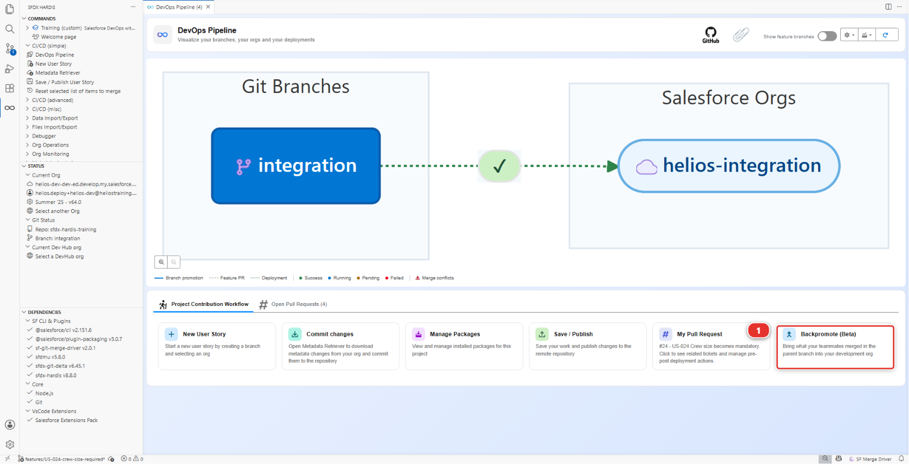
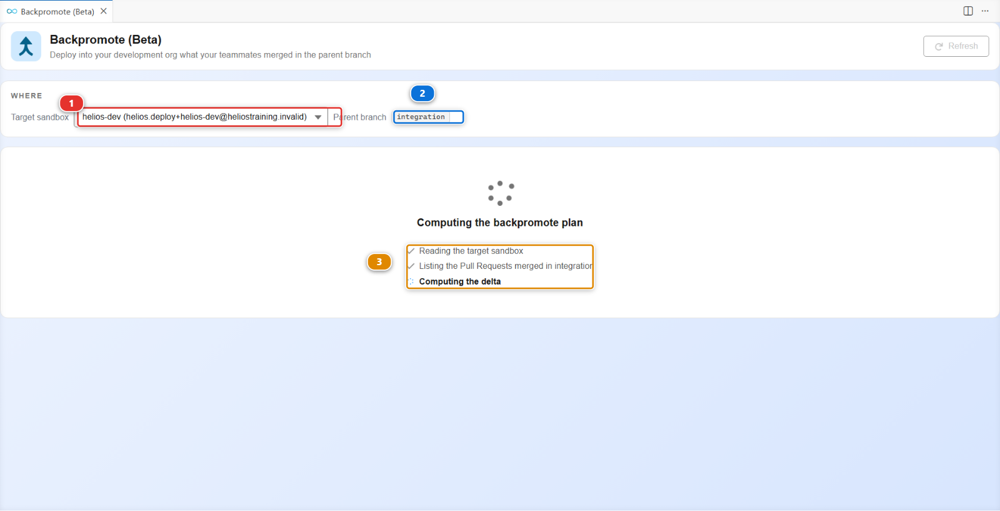
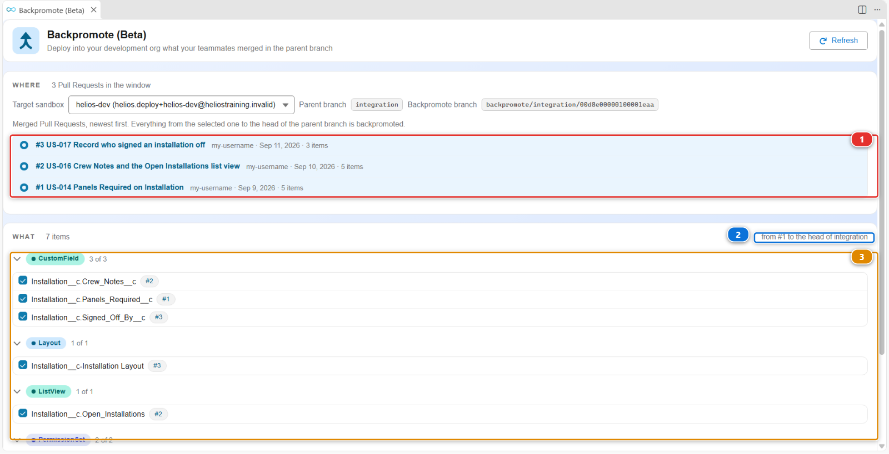
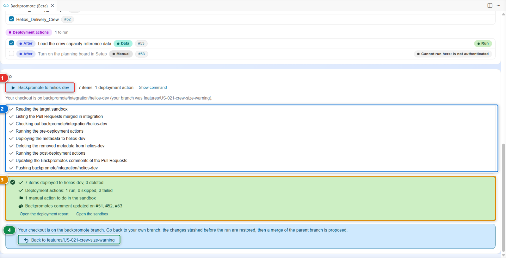

# Lab 2.1 - Backpromote: catch your org up with the team

**Level**: 2 Contributor advanced

**Time**: ~15 min

**You will**: bring three teammates' merged stories into your own dev org, decide what to keep when
the tool asks, and learn what a backpromote will never do for you.

## The situation

You were away for two weeks. While you were gone, three stories were merged into `integration` and
deployed. Your `helios-dev` org still looks like the day you left.

Build your next story on top of that and you will produce a diff full of things that look like
deletions, because your org does not have what everyone else's has. This is the most common way a
contributor accidentally undoes a teammate's work.

## Before you start

- [ ] Level 1 finished, or **Training: Level 2 > Reset this level** on level 2
- [ ] `helios-dev` connected in **Orgs Manager**
- [ ] No uncommitted changes you care about

## Steps

### 1. Bring your teammate's work in

The two weeks you were away have to exist before you can catch up on them. Romain does not exist,
but his work does: the training replays it in **your own** fork, as a Pull Request you merge.

#### 1a. Run Simulate my teammates

In the sfdx-hardis command list, expand **Training: Level 2** **(1)** and click **Simulate my
teammates** **(2)**. The same entry is on the Welcome page, under **Training: Level 2**.

A command panel opens and asks three questions. Answer them this way:

| Question                               | Answer                                                  |
|----------------------------------------|---------------------------------------------------------|
| Which teammate work do you need?       | **US-017 Record who signed an installation off**        |
| Create it?                             | **Yes**                                                 |
| Merge it for you once its checks pass? | **Yes**, unless you want to merge it yourself (step 1b) |

If VS Code first asks how to allow the Training command, choose **Always allow**, as in
[Lab 1.2](../level-1-contributor-basics/1-2-create-your-dev-hub-scratch-orgs-and-pipeline.md).

The command creates the branch `training/mate-us-017-sign-off` from your current `integration`,
commits Romain's change under his name, pushes it to your fork on GitHub and opens the Pull Request.
The panel prints its address: keep it, you need it in step 1b.

With **Yes** to the last question, the panel then waits for the two checks of the Pull Request,
about two to four minutes, and merges it as soon as both are green. It writes
**Pull Request merged into its base branch**, then **Done**. You can skip step 1b and go straight to
step 2. If you merge it yourself on GitHub while the panel is still waiting, it notices and stops
there too.

If it says a check failed, or that it could not merge, nothing is lost: the Pull Request is still
open, and step 1b is the way to finish.

Under the hood: what Simulate my teammates did

The Training entry ran:

    node scripts/training.mjs simulate --level 2

It applied the patch set of `scripts/simulate/us-017-sign-off/` to your working copy, committed it
with Romain's name and email, pushed the branch and opened the Pull Request with `gh pr create`.
Your own uncommitted changes, if you had any, were put aside first and put back at the end.

With **Yes** to the merge, it gave you back your own branch first, then asked GitHub for the state
of the Pull Request's checks every twenty seconds (`gh pr checks`), and ran `gh pr merge --squash`
once all of them, **Simulate Deployment to Major Org** and **Mega-Linter** among them, were green.
The same rule as the button: your fork's `integration` is protected, and GitHub would refuse the
merge while a check is red or running.

#### 1b. Or review and merge it yourself on GitHub

Only if you answered **No**, or if the panel could not merge.

1. Open the Pull Request: click the address the panel printed, or open your fork on GitHub
   (`github.com/my-username/sfdx-hardis-training`), click the **Pull requests** tab, then
   **US-017 Record who signed an installation off**
2. Click **Files changed** **(1)**. The file list on the left **(2)** has two files, the permission
   set `Helios_Delivery_Manager` and the `Installation` layout. Each line of the diff **(3)** is one
   change, green when added and red when removed. Romain only adds: read and edit access on
   `Signed_Off_By__c`, and the field on the layout. That is the review: you are checking that the
   Pull Request does what its title says, and nothing else

   

   The picture is a later teammate Pull Request, US-052: yours shows Romain's two files, and the
   tabs and buttons are the same.

3. Go back to the **Conversation** tab and scroll to the bottom. While a check is still running,
   the box reads **Merging is blocked**: wait, the page updates on its own. When it reads **All
   checks have passed**, the **Merge pull request** button **(1)** is live

   

4. Click the small arrow **(1)** on the right of the green button, choose **Squash and merge**
   **(2)**, then click **Squash and merge** and **Confirm squash and merge**. The badge at the top
   of the page turns purple and reads **Merged**

   

This is the same merge as [Lab 1.6](../level-1-contributor-basics/1-6-pull-request-deployment-check-and-merge.md), step 4. A
check that fails here is not your fault and not something to fix: run **Simulate my teammates**
again, it recreates the branch and the Pull Request.

#### 1c. Where you are now

`integration` now carries three merged Pull Requests your org has never seen as a deployment: your
two Level 1 stories, which are in `helios-dev` only because you built them there, and Romain's, which
is nowhere near it.

### 2. Open Backpromote

In the **DevOps Pipeline** panel, under **Project Contribution Workflow**, click the
**Backpromote (Beta)** card **(1)**.

It computes its plan before it shows you anything:

1. **Target sandbox** **(1)** is the org the work comes down into, `helios-dev`
2. **Parent branch** **(2)** is where it comes from, `integration`
3. The three lines **(3)** read your org, list the Pull Requests merged in `integration`, and work
   out the difference between the two

"Backpromote" is the direction that matters: work normally flows **up**, from your branch to
integration to uat to production. A backpromote brings it **down** again, from a major branch into
your own environment, so you are building on what the team has rather than on what you remember.

### 3. See how far behind you are

The **WHERE** block at the top of the panel answers that, and it is the only place that does.
**3 Pull Requests in the window**: three stories were merged into `integration` since the last time
anything came down into your org.

That count, not your memory, is what tells you whether a refresh is needed. On a Monday after a
week off it is worth reading before anything else.

### 4. Choose what comes down

When the plan is ready the panel fills in. The merged Pull Requests are listed newest first
**(1)**: pick the oldest one you want, and everything from there to the head of `integration`
**(2)** comes down. Below, what differs between `integration` and your org is listed by metadata
type, each item with its own tick **(3)**.

Go through the list rather than clicking "all":

| What you see                                         | What to do                                                        |
|------------------------------------------------------|-------------------------------------------------------------------|
| Metadata from the three merged stories               | **Take it.** That is the whole point                              |
| Something you are half way through building yourself | **Leave it.** A backpromote would overwrite your work in progress |
| Something you do not recognise at all                | **Take it.** If it is on `integration`, it is the team's truth    |

For a file that both sides changed, the panel offers a third answer beside **Overwrite** and **Keep
org version**: **Merge**. It writes the file with both versions in it, marked, and you pick between
them in the VS Code merge editor, the same way [Lab 2.7](2-7-resolve-a-git-merge-conflict.md) has you resolve a Pull Request conflict.
Reach for it when both changes are real and you need both.

The rule when you hesitate: `integration` wins. It is the shared reality, and your org is a copy of
it that you are allowed to modify temporarily.

### 5. Run it and read the result

Click **Backpromote to helios-dev** **(1)**. The panel works through the run step by step **(2)**,
and when it finishes it tells you what happened **(3)**.

Read the summary rather than the colour:

- how many items reached your org, and how many were deleted from it
- which Pull Requests it wrote its history onto, so the next backpromote knows where to start

The three stories carry no deployment action. When the ones you bring down do, the summary also
says how many ran, were skipped or failed, and **how many manual actions are waiting for you in the
sandbox**, which nothing can do for you.

Then click **Back to `<your branch>`** **(4)**. It is the last button of the panel and the one
people miss, and the next note explains why it matters.

Under the hood: what Backpromote just did

The panel ran:

    sf hardis:work:backpromote

which:

1. Fetched `integration` and compared it with your branch
2. Built a plan: the components that differ, and for each one whether it is added, changed or
   removed
3. Deployed the ones you selected into your dev org, using the same deployment engine as the CI
4. Recorded what it did, so a second run does not redo the same work

Three things it deliberately does **not** do, and knowing them saves an afternoon:

- **It does not bring records on its own.** It deploys metadata, and it runs the deployment actions
  the merged Pull Requests declared, which is where a data load would live. If a teammate's story
  needed reference data and nobody declared an action for it, that data is not in your org, and no
  deployment will ever put it there. [Lab 2.4](2-4-ship-reference-data-and-a-batch-with-deployment-actions.md) is about that exact problem
- **It does not undo what you did by hand.** If you changed something in your org that
  `integration` also changed, the deployment overwrites it. That is why you read the list
- **It does not touch the shared orgs.** A backpromote refuses a production org, and any org a
  major branch deploys to. It only ever writes to a developer sandbox, a scratch org or a Developer
  Edition org

And one thing it does that nobody expects the first time:

!!! warning "It leaves you on the backpromote branch"
    The deployment runs from a branch called `backpromote/integration/<your org>`, and **the
    checkout stays there when the command finishes**. The panel says so, and offers the
    **Back to `<your branch>`** button **(4)** to undo it: it restores the changes it stashed
    before the run, then proposes a merge of the parent branch.

    Take that button. If you do not, **New User Story** still branches from the target you pick, so
    nothing breaks, but anything you had in progress stays stashed behind a branch you have
    forgotten about. The branch you are on is always in the bottom left corner of VS Code.

The history is not on your computer either. sfdx-hardis records what reached your sandbox in a
**Backpromotes comment** on each Pull Request it brought down, so the next backpromote knows where
to start, from any machine and any teammate. That is also why the command needs a git provider
token: without one it cannot read its own history, and it stops.

<!-- command-links:start -->
Command documentation: [hardis:work:backpromote](https://sfdx-hardis.cloudity.com/hardis/work/backpromote/)
<!-- command-links:end -->

## What you should see

Open `helios-dev` and check that the metadata from the three merged stories is there. In particular
`Panels_Required__c` and `Crew_Notes__c` from Level 1, if you did Level 1 in a different org.

## If it goes wrong

**Simulate my teammates says no check ran on the Pull Request.**
The Checks tab of the Pull Request is empty: GitHub Actions are off on your fork.
[Lab 1.6](../level-1-contributor-basics/1-6-pull-request-deployment-check-and-merge.md), step 2, says how to turn them on. Then
merge it yourself, step 1b.

**The panel says "Nothing to commit".**
Romain's change is already in your `integration`: you merged it earlier, and the panel prints the
address of that merged Pull Request. Go on with step 2.

**The panel says there is nothing to backpromote.**
Your org is already level with `integration`, which happens if you just finished Level 1 in the same
org. Nothing to do: move on.

**The deployment fails on a component that depends on something else.**
Take the whole set rather than a subset. Metadata has dependencies, and half a story often does not
deploy.

**Your own work in progress was overwritten.**
It was in the list and you took it. Rebuild it in the org: it is still in your branch if you
committed it, and the deployment only changed the org.

## Check your work

Welcome page > **Training: Level 2** > **Check my work**, then pick **Lab 2.1**.

## Go deeper

- [Backpromote](https://sfdx-hardis.cloudity.com/salesforce-devops-backpromote/)

[Next: Lab 2.2 - Fix a deployment error caused by a missing dependency](2-2-fix-a-missing-dependency-deployment-error.md){ .md-button .md-button--primary }
