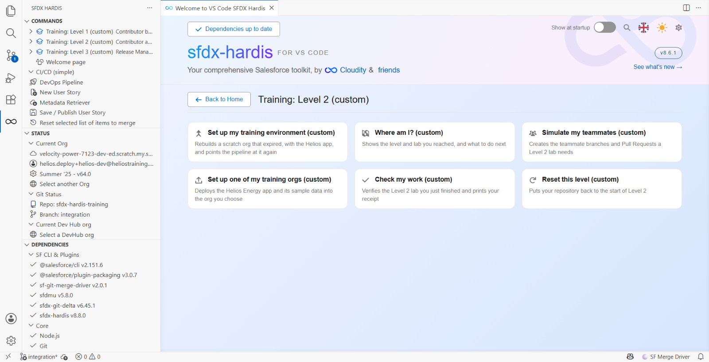

# Level 2 - Contributor advanced

**Time**: about 4 h.

**Before you start**: [Level 1](../level-1/index.md). Not optional: every lab here assumes the loop
is automatic for you.

## The story

Three months in. You have delivered a dozen stories and the loop is muscle memory. Then the ones
that do not go through start arriving.

A deployment that fails on a dependency nobody told you about. A field that cannot be made required
because the org already holds thirty records without it. Reference records and a nightly batch that
have to follow your change into every org, and no deployment will carry them for you. Marco, who
edited the same flow and the same permission set as you and merged first.

This is the half of the contributor path that decides whether you enjoy working on a CI/CD project.

## What you will do

| Lab                                    | Title                                          | Time   |
|----------------------------------------|------------------------------------------------|--------|
| [0](lab-00-refresh.md)                 | Your org is behind, catch it up                | 15 min |
| [1](lab-01-missing-dependency.md)      | US-021 will not deploy: a missing dependency   | 25 min |
| [2](lab-02-deployment-actions-apex.md) | US-024: green deployment, broken records       | 30 min |
| [3](lab-03-deployment-actions-data.md) | US-026: reference data and a batch must follow | 30 min |
| [4](lab-04-quality-and-tests.md)       | US-027 fails the quality gate and the tests    | 30 min |
| [5](lab-05-profiles-overwrites.md)     | US-033: your Profile change disappeared        | 25 min |
| [6](lab-06-conflicts.md)               | Marco merged first: resolve the conflict       | 35 min |
| [7](lab-07-recover-selection.md)       | You committed the wrong things: recover        | 20 min |
| [8](lab-08-capstone.md)                | Capstone: deliver US-041                       | 30 min |

## The Training menu

Everything this course asks you to run outside the product's own buttons lives in one menu. Open the
**Welcome page**, and under **CUSTOM MENUS** click the **Training: Level 2** card. Its commands take
over the page:

Six of them, and the labs call them by these names:

| Command                            | What it does                                                       |
|------------------------------------|--------------------------------------------------------------------|
| **Set up my training environment** | Rebuilds a scratch org that expired, and points the pipeline at it |
| **Where am I?**                    | Says which level and lab you reached, and what to do next          |
| **Simulate my teammates**          | Creates the teammate branches and Pull Requests a lab needs        |
| **Set up one of my training orgs** | Deploys the Helios app and its data into an org you choose         |
| **Check my work**                  | Verifies the lab you just finished and prints your receipt         |
| **Reset this level**               | Puts your repository back to the start of Level 2                  |

There is one menu per level, and each holds only what that level needs, so nothing in front of you is
for a lab you have not reached.

The same commands are in the **SFDX HARDIS** view of the left bar, under **Training: Level 2**.
Either route runs the same thing.

## If you are joining here

You can start Level 2 without having done Level 1, as long as you accept that the labs assume the
loop. Get to a known state first:

1. Do [Level 1 lab 0](../level-1/lab-00-setup.md) and [lab 1](../level-1/lab-01-fork-and-connect.md)
   in full: tools, your Developer Edition org, the scratch orgs, fork, Actions, the secrets
2. Welcome page > **Training: Level 2** > **Reset this level**

That puts your `integration` branch at `training/start-level-2`, which is what the repository looks
like once Level 1 is done.

## If you are coming back after a break

The three scratch orgs Level 1 created live 30 days. If **Orgs Manager** no longer lists one of them
as **Connected**, it expired: Welcome page > **Training: Level 2** > **Set up my training
environment**. It creates a new one with the Helios app, points the pipeline at it, and leaves the
others alone.

A new `helios-dev` starts from the app as it ships, without the stories you already merged. Lab 0
is precisely how you bring them in.

## One thing to keep open

`MY-PIPELINE.md`. Several labs here ask you to write a line in it, and the badge audit reads it. It
is also the file you would keep on a real project so the next person can see how things were put
together. Copy `MY-PIPELINE.template.md` over it and start filling it in.

[Start with Lab 0](lab-00-refresh.md){ .md-button .md-button--primary }
