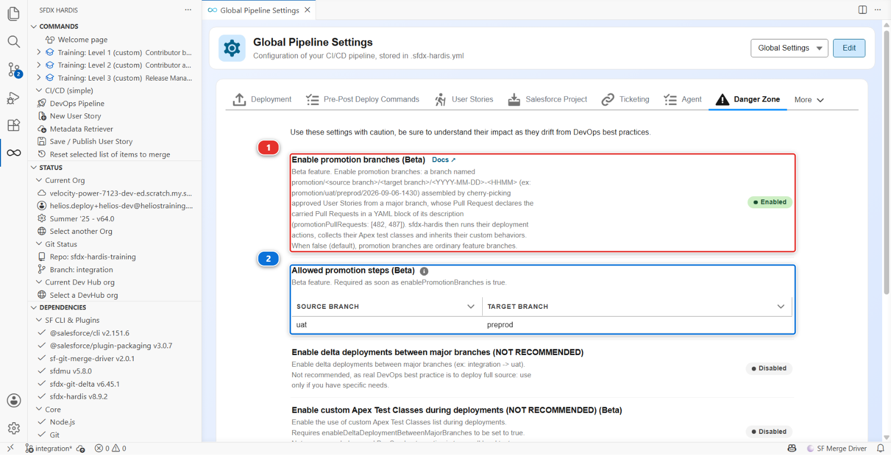
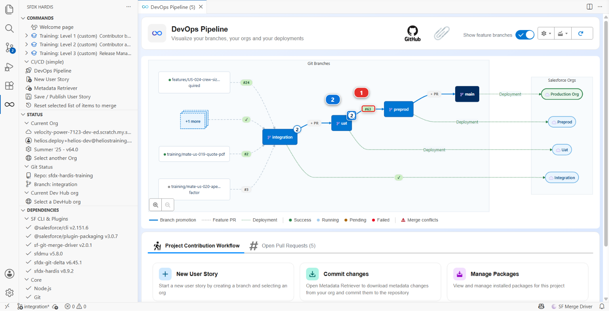

# Lab 3.10 - Promote a subset with promotion branches (Beta)

**Level**: 3 Release Manager

**Time**: ~35 min

**You will**: ship one approved User Story to preprod while another one stays behind in UAT, using
the one feature of sfdx-hardis you should hope never to need twice in a row.

## The situation

Two stories landed this week and both are in UAT.

**US-057**, Mariia's, gives planners an *Awaiting Parts* status for an installation held up by a
missing part. The operations lead tested it on Tuesday and signed it off in writing.

**US-058**, Romain's, stores the warranty term on a panel batch. It works. Nobody has approved the
wording, because the person who approves wording is away until the middle of next week.

The release is Thursday and the date does not move: the warehouse cutover depends on the new status
being in production before the weekend.

So you have a release window holding one approved story and one story nobody has said yes to, and
the ordinary promotion is all or nothing. It carries `uat` as it stands, US-058 included.

!!! warning "This is the exception, and it should stay rare"
    Promoting branches rather than features is the recommended way, and every other lab of this
    level does it. A version whose stories were tested together is the version that was tested.

    A promotion branch breaks that on purpose. After it, `uat` and `preprod` hold different things,
    the orgs behind them drift apart, and production runs a combination nobody ever tested as a
    whole. That is a real cost, paid later, usually by whoever is on call.

    Use it when a date cannot move and an approval has not arrived. Do not build a process on it:
    a team that assembles a promotion branch every week has a sign-off problem, not a tooling
    problem, and the fix is upstream.

## Before you start

- [ ] [Lab 3.9](3-9-generate-the-project-documentation.md) finished
- [ ] All four branches deploying, and the four orgs connected
- [ ] `enablePromotionBranches` and `allowedPromotionSteps` published in
      [Lab 3.1](3-1-configure-the-pipeline-up-to-production.md), and carried up to `preprod` by the promotions of Labs 3.5 and 3.6

## Steps

### 1. Check the feature is on, and where it is allowed

The two settings this lab needs were published in [Lab 3.1](3-1-configure-the-pipeline-up-to-production.md) and have been travelling up the
pipeline with every promotion since. Look at them before you rely on them.

Open the **DevOps Pipeline** panel, the gear menu, **Pipeline Settings**, scope **Global Settings**,
and the **Danger Zone** tab.



Read the line at the top of that tab before anything else: *Use these settings with caution, be
sure to understand their impact as they drift from DevOps best practices.* The product puts this
feature in the same drawer as delta deployments between major branches, and for the same reason.

**Enable promotion branches (Beta)** **(1)** reads **Enabled**: the feature is on for the whole
project. **Allowed promotion steps (Beta)** **(2)** holds one row, source `uat` and target
`preprod`, and says that is the only step a release manager here may assemble a promotion on.

That second setting is not paperwork. It is why the button you are about to use exists on `uat` and
not on `integration`: a subset is a decision about what goes to the stage in front of production,
and nobody needs to make it on the way into an integration org that is rebuilt from the branch
anyway. `sf hardis:project:promotion:create` refuses to run at all while the list is missing,
rather than guessing that every major branch may promote into every other one.

<details markdown="1"><summary>Under the hood: why a switch published in [Lab 3.1](3-1-configure-the-pipeline-up-to-production.md) matters now</summary>

Both settings are project level, in `config/.sfdx-hardis.yml`:

    enablePromotionBranches: true
    allowedPromotionSteps:
      - source: uat
        target: preprod

The deployment job of a promotion Pull Request runs on the promotion branch, and a promotion branch
is cut from its **target**, so the configuration it reads is the one `preprod` carries. A switch
turned on today in `integration` would not be in `preprod` until a promotion put it there, and until
then the job would treat the promotion Pull Request as an ordinary feature branch: it would still
deploy, and it would quietly ignore the stories the branch declares.

That is why the switch was published in [Lab 3.1](3-1-configure-the-pipeline-up-to-production.md) with the rest of the pipeline configuration, and why
it has been inert ever since: with no promotion branch in the repository, a project with the feature
on behaves exactly like a project with it off.

</details>

### 2. Take in the two stories, and promote them the usual way

Nothing here is new, so it is written short. If a step does not ring a bell, the lab that taught it
is linked.

**Welcome page** > **Training: Level 3** > **Simulate my teammates**, and take both:

- **US-057 Park an installation that is waiting for parts**
- **US-058 Record the warranty term on a panel batch**


Review each one with the four questions of [Lab 3.2](3-2-review-a-contributor-pull-request.md) and merge both into `integration`, then watch the
deployment. Then promote `integration` into `uat` the way [Lab 3.5](3-5-promote-to-uat-and-write-release-notes.md) did: the **+ PR** chip on the
arrow, a title a human can read, **Merge pull request** and never a squash.

Both stories are now in `uat`, deployed to `helios-uat`, and this is the moment a real week reaches:
everything is testable, and only part of it is approved.

### 3. Decide, before you touch anything

You have three options and the tool only helps with one of them. Know why you picked it.

| Option                            | What it costs                                                                                          | When it is right                                                                                  |
|-----------------------------------|--------------------------------------------------------------------------------------------------------|---------------------------------------------------------------------------------------------------|
| **Wait for the approval**         | The release slips by a week                                                                            | Almost always. It is the only option that keeps the orgs aligned                                  |
| **Take US-058 back out of `uat`** | A revert on a branch other people build on, and the story has to come back later, rebased and retested | When the story is genuinely wrong, not merely unapproved                                          |
| **Carry US-057 alone**            | `uat` and `preprod` drift apart until the next full promotion                                          | When the date is fixed, the approval is not coming, and the story left behind is fine where it is |

This week it is the third one, and the reason is written down: the warehouse cutover.

Write that reason somewhere a successor will find it. The Pull Request you are about to create is a
good place, and step 6 comes back to it.

### 4. Pick what goes

Open the **DevOps Pipeline** panel and click the `uat` node. The window that opens is the one
[Lab 3.5](3-5-promote-to-uat-and-write-release-notes.md) used to read a promotion window, with two things on it that were doing nothing until
now.


A **checkbox** on each User Story row **(1)**, and **Create promotion from uat (Beta)** in the
footer **(2)**. Both appear because `uat` is the source of an allowed promotion step and `preprod`
is where it goes.

Tick **US-057** and leave US-058 alone. The button label counts what you ticked: **Create promotion
from uat (1 selected) (Beta)**. Click it.

A command execution tab opens and asks one question, **Select the Pull Requests to carry in the
promotion branch**, with US-057 already ticked: the panel passed your choice to the command, and the
command asks you to confirm it rather than taking it on trust. Confirm.

Then read the log, because it is doing something you would otherwise be doing by hand:

```
Creating promotion branch promotion/uat/preprod/2026-09-24-0930 from origin/preprod...
Cherry-picking #NNN US-057 Park an installation that is waiting for parts (my-username) [7c41ab9]...
Pushing promotion branch promotion/uat/preprod/2026-09-24-0930...
Creating the Pull Request from promotion/uat/preprod/2026-09-24-0930 to preprod...
Promotion Pull Request created: https://github.com/my-username/sfdx-hardis-training/pull/NNN
Promotion branch promotion/uat/preprod/2026-09-24-0930 assembled with 1 User Story(ies): #NNN
```

<details markdown="1"><summary>Under the hood: what the button ran, and what the branch name means</summary>

The button ran, in the command execution panel:

    sf hardis:project:promotion:create --source-branch uat --target-branch preprod --pull-requests NNN

`--target-branch` was passed rather than asked because `allowedPromotionSteps` leaves `uat` exactly
one target. With several allowed, the command would have asked.

The branch is named `promotion/<source>/<target>/<YYYY-MM-DD>-<HHMM>`, in UTC, and a `-2`, `-3` is
appended only when that minute is already taken. The shape is fixed and not configurable: the
deployment jobs, the pipeline diagram and the release notes all recognise a promotion by it.

It is cut from `origin/preprod`, not from `uat`. That is the whole trick: a branch that starts from
the target and receives only the chosen commits cannot carry anything you did not choose. The
commits are copied with `git cherry-pick -x`, which keeps the original message and adds a
`(cherry picked from commit ...)` line, so the copy can be traced back to the commit on `uat` that
it came from.

A cherry-pick rewrites the commit SHA, which is why the Pull Request has to declare what it carries
in words: nothing in git links the copy to the Pull Request it came from any more.

<!-- command-links:start -->
Command documentation: [hardis:project:promotion:create](https://sfdx-hardis.cloudity.com/hardis/project/promotion/create/)
<!-- command-links:end -->

</details>

### 5. Read what it created

Open the Pull Request. It is titled `Promotion uat to preprod (2026-09-24-0930)`, and its
description holds the only thing that makes any of this work:

````markdown
Promotion branch `promotion/uat/preprod/2026-09-24-0930` carrying 1 User Story approved in `uat`,
cherry-picked for `preprod`.

```yaml
promotionPullRequests: [NNN]
```

## Carried Pull Requests

| Pull Request | Title                                                 | Author      | Source branch                         | Commit    |
|--------------|-------------------------------------------------------|-------------|---------------------------------------|-----------|
| #NNN         | US-057 Park an installation that is waiting for parts | my-username | `training/mate-us-057-awaiting-parts` | `7c41ab9` |
````

The **Author** column is the GitHub account that opened the Pull Request, so on this course it is
your own handle rather than Mariia's: the teammate wrote the commit, `Simulate my teammates` opened
the Pull Request with your account. The branch window of the panel shows the commit author, which is
why the two disagree.

The **Title** comes from the Pull Request, read through the git provider API. The command requires
that connection and refuses to start without it, so a promotion behaves the same on GitHub, GitLab,
Bitbucket and Azure DevOps and every carried row names its real story. You never see the refusal
here: the extension passes its own GitHub connection, signed in since
[Lab 1.2](../level-1-contributor-basics/1-2-create-your-dev-hub-scratch-orgs-and-pipeline.md). From a terminal or an agent, the token has to be provided
(`GITHUB_TOKEN`, in the environment or in a `.env` file at the repository root).

**That yaml block is the declaration**, and every job that runs on this Pull Request reads it. It is
how US-057 keeps, in `preprod`, everything it would have had in an ordinary promotion: its
deployment actions run, its Apex test classes are selected, its ticket is updated, and the release
notes of `preprod` name the story rather than the promotion that carried it.

Delete that block and you have a branch with some commits on it and no idea what they are for. Keep
it, and do not hand-edit the numbers: the command wrote what it actually cherry-picked.

Now go back to the **DevOps Pipeline** panel and look at the diagram.



The promotion in flight is drawn on the arrow between `uat` and `preprod` **(1)**, with its Pull
Request number, where the **+ PR** chip used to be: it is not a branch of your pipeline, it is
something moving between two of them, and it lives exactly as long as its Pull Request.

The counter on the `uat` node **(2)** still reads two User Stories waiting, and that is right:
nothing has moved yet. A promotion that is open is a proposal. Merge it, come back, and the counter
reads one, because **a Pull Request appears in one place only**: from then on US-057 is listed in
the window of `preprod`, the branch it reached, and no longer in the window of `uat`, the branch it
left.

### 6. Add the reason, then read the check

**Edit the description** and put your reason above the generated text, in a sentence the person
reading this in six months can use:

> Warehouse cutover on Monday needs the Awaiting Parts status in production. US-058 stays in UAT
> until the wording is approved, expected Wednesday next week.

Then read the sfdx-hardis comment on the Pull Request. Its first line is the one to check:

> ℹ️ `promotion/uat/preprod/2026-09-24-0930` is a promotion branch carrying 1 Pull Request(s)
> declared in its description: #NNN. Deployment actions, Apex test classes and custom behaviors of
> those Pull Requests are processed.

If that line is missing, or says none of the declared Pull Requests could be used, **stop and fix it
before merging**. It means the job did not read the declaration, and the deployment about to run is
the metadata without anything that goes with it.

The rest of the check reads like any other: the counts line, what is added, modified and deleted.
The delta is small on purpose. A promotion branch carries one story, so it deploys one story.

### 7. Merge, and verify the selectivity in the org

Merge with **Merge pull request**. Never a squash: the cherry-picked commits and their trailers are
what the next promotion, the retrofit and the release notes all read.

The **Process Deployment (sfdx-hardis)** run starts on `preprod`. When it is green, open
`helios-preprod` and check both halves of what you did:

- **Setup > Object Manager > Installation > Fields & Relationships > Status**: the picklist offers
  **Awaiting Parts**. US-057 is there
- **Setup > Object Manager > Panel Batch > Fields & Relationships**: there is no **Warranty Years**
  field. US-058 is not, and that is the point

Deployed and *only* what you chose deployed are two different checks, and this lab is the one where
the second one matters.

### 8. Count what it cost

Look at the pipeline now, and say out loud what is true:

- `uat` holds US-057 and US-058. `preprod` holds US-057 only
- `helios-uat` and `helios-preprod` are no longer the same org, and they will stay different until
  the next full promotion
- Production is about to run a combination of metadata that was never tested as a whole anywhere:
  what `preprod` holds today existed in no org before this morning

None of those is a bug. They are the price, and you paid it deliberately for a fixed date. The
failure mode is not paying it once: it is paying it every week, quietly, until nobody can say what
any of the four orgs contains.

Two habits keep it honest, and they cost nothing:

1. **The promotion Pull Request says why.** You did that in step 6
2. **The exception ends.** The next ordinary promotion of `uat` carries US-058 up, and the
   pipeline is aligned again. [Lab 3.11](3-11-capstone-run-a-weekly-release-cycle.md) is that promotion: US-058 is still waiting in `uat`
   on Monday morning, and it goes out with everything else

<details markdown="1"><summary>Under the hood: what happens to US-058 next, and what a promotion looks like from above</summary>

Nothing special. US-058 is a User Story merged into `uat` that has not been promoted, exactly like
every other story the day before a release, and the next `uat` into `preprod` Pull Request carries
it the ordinary way.

What sfdx-hardis has to be careful about is US-057, which is in **both** branches by different
routes: merged into `uat`, cherry-picked into `preprod`. The next promotion of `uat` will bring the
original commit up too, and git will merge it cleanly because the content is already there. The
pipeline diagram and the release notes both know it was already promoted (`promotedAway`), so it is
listed once, on the branch it really reached, and the notes of the next release do not announce it
twice.

The same expansion works one level up: when `preprod` is promoted to `main`, the merge commit that
arrives carries the promotion, not the stories under it. sfdx-hardis reads the promotion's
declaration and puts US-057 back in scope by name, so its deployment actions run in production too.

</details>

## What you should see

- A merged Pull Request titled `Promotion uat to preprod (<date>-<time>)`, from a branch named
  `promotion/uat/preprod/<date>-<time>`
- A `promotionPullRequests` block in its description naming US-057 and nothing else, with your
  reason written above it
- A green **Process Deployment (sfdx-hardis)** run on `preprod`
- **Awaiting Parts** in the Status picklist of `helios-preprod`, and no **Warranty Years** field on
  Panel Batch there
- The `uat` node of the diagram counting one User Story still waiting

## If it goes wrong

**The uat window has no checkboxes and no Create promotion button.**
Either the feature is off in the configuration your workspace is reading, or `allowedPromotionSteps`
does not name `uat` as a source with `preprod` as a target. Step 1 shows both. A step pointing at a
branch the pipeline does not merge into opens nothing, on purpose.

**The command stops saying the allowed steps are missing.**
`allowedPromotionSteps` is required as soon as `enablePromotionBranches` is on. It is not a default
sfdx-hardis is willing to invent: which branches a release manager may promote between is a decision
about your pipeline.

**The cherry-pick conflicts.**
The story you chose depends on one you left behind. The command offers to leave it out, or to commit
it with its conflict markers and solve them on the branch afterwards, by hand or with a coding
agent. Whatever you pick, the validation job refuses to deploy a branch that still holds conflict
markers, and says so in a comment on the Pull Request rather than failing silently. The honest
answer is usually to promote the story it depends on as well.

**The sfdx-hardis comment does not mention a promotion branch.**
The deployment job read a configuration with the feature off. Check that `preprod` carries
`enablePromotionBranches: true` in `config/.sfdx-hardis.yml`: the branch the job reads is the
promotion branch, which was cut from `preprod`.

**The command stops saying it needs the git provider connection.**
The promotion is assembled from the Pull Requests of `uat`, and only the git provider names them
reliably, so the command refuses to guess without it. In VS Code that connection is the GitHub
sign-in of [Lab 1.2](../level-1-contributor-basics/1-2-create-your-dev-hub-scratch-orgs-and-pipeline.md), and the extension passes it on its own: sign in again if it
was revoked. From a terminal or an agent, set `GITHUB_TOKEN`, in the environment or in a `.env`
file at the repository root, and keep that file out of git.

**The deployment is much bigger than one story.**
Look at what the branch was cut from. A promotion branch built when `preprod` was behind carries the
difference with it. That is a reason to promote normally more often, not a reason to build a bigger
promotion.

## Check your work

Welcome page > **Training: Level 3** > **Check my work**, then pick Lab 3.10.

## Go deeper

- [Promotion branches (Beta)](https://sfdx-hardis.cloudity.com/salesforce-devops-promotion-branches/)
- [hardis:project:promotion:create](https://sfdx-hardis.cloudity.com/hardis/project/promotion/create/)
- [Hotfixes](https://sfdx-hardis.cloudity.com/salesforce-devops-hotfixes/), which is the right tool
  for an urgent fix that was never in `uat`

[Next: Lab 3.11 - Capstone: run a weekly release cycle](3-11-capstone-run-a-weekly-release-cycle.md){ .md-button .md-button--primary }
