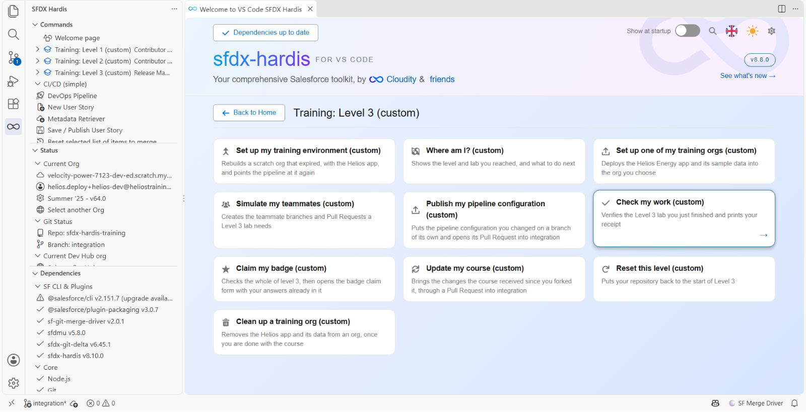
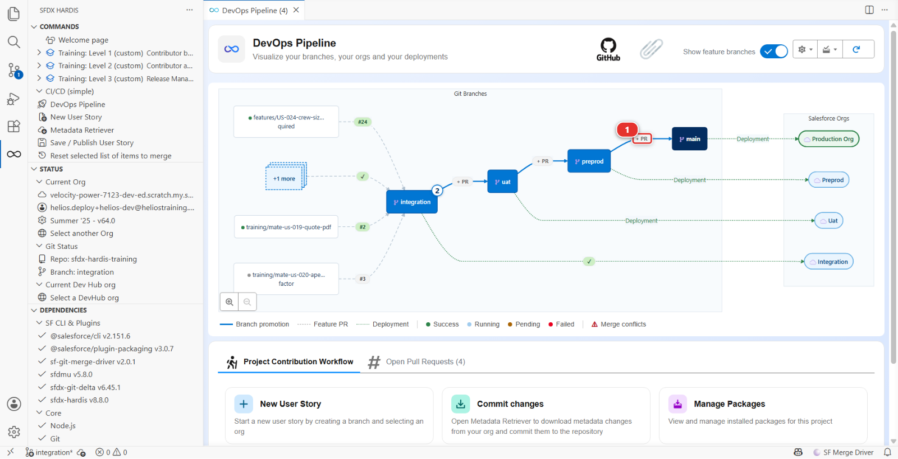
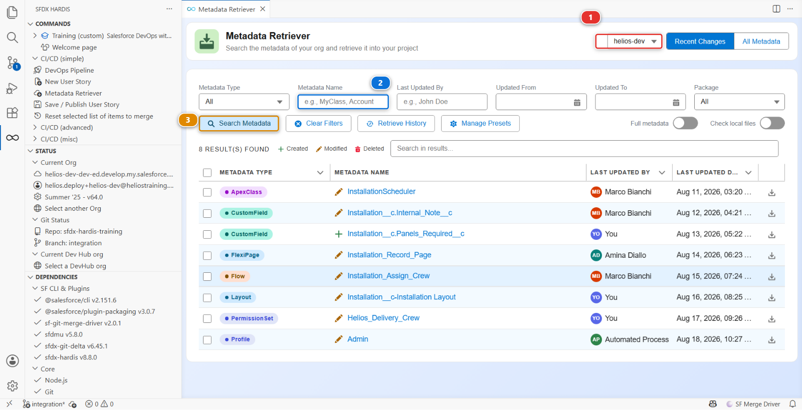

# Lab 3.7 - Production is broken: hotfix and retrofit

**Level**: 3 Release Manager

**Time**: ~35 min

**You will**: ship a contributor's fix through `preprod` and `main`, retrofit it back down into
`integration`, then repair a change an admin made by hand in production.

## The situation

Two problems, and they arrive in the order they always do.

**17:40 on a Friday.** Planners close the week by cancelling the installations the crews could not
reach and back-dating them to the day it was called off. Every one of those saves is refused. The
`Installation_Date_Not_Past` validation rule exempts installations that are `Completed` and says
nothing about the ones that are `Cancelled`, so a job that will never happen is held to a rule about
scheduling it. Waiting for the normal path means the week does not close until Monday.

**Monday morning.** While the incident was on, an admin added a picklist value straight into
production, because it looked like the fastest way to unblock people. It works. It is in production
and in no branch, and the next deployment will silently take it away again.

The first of the two is normal, and the pipeline is built for it. **The second is not.** Nobody
changes production by hand on a project with a pipeline: the fix was a hotfix, exactly like the one
you are about to ship, and doing it in Setup instead bought a few minutes on Monday and cost the
repair you will spend Part 3 doing. Part 3 is that repair, and the lesson in it is the sentence the
admin needed on Monday morning, not a technique to keep handy.

## Before you start

- [ ] Lab 3.6 finished: the release is in production
- [ ] `helios-preprod` and `helios-prod` connected in **Orgs Manager**

## Part 1: the hotfix

### 1. Decide that it is a hotfix

**A hotfix does not skip the pipeline.** It enters it further along. An ordinary story starts on
`integration` and travels `integration` to `uat` to `preprod` to `main`. A hotfix starts on
`preprod` and travels `preprod` to `main`. Same branches, same protection, same checks, same
deployment jobs: the only difference is where it joins.

That is what makes it safe, and it is why Lab 3.1 put `preprod` in `availableTargetBranches`.
Nothing is bypassed, so nothing has to be remembered afterwards, except the one thing Part 2 is
about: `main` now carries a commit that `integration` has never seen.

It is the release manager's call, and it is right when **all three** are true:

1. Production is broken for real users right now
2. The fix is small and you can describe its blast radius in one sentence
3. Waiting for the work already queued in `integration` and `uat` to go out first is genuinely not
   acceptable

If any one is false, it is an ordinary story that happens to be urgent. Most things called hotfixes
are ordinary stories.

### 2. Get the fix from the right branch

This is the part people get wrong, and it produces an incident on top of an incident.

`integration` carries next week's work. A fix branched from it ships next week's work to production
tonight. `preprod` carries exactly what production runs, which is why Lab 3.1 made it the branch a
hotfix starts from, and why **New User Story** offers `preprod` as a target to contributors.

Romain takes the fix. **Training: Level 3** > **Simulate my teammates**, and pick **US-045 Hotfix:
cancelled installations can be back-dated again**.



It opens his Pull Request from `fix/US-045-installation-date-hotfix` into **`preprod`**: his branch
was cut from `preprod`, the way **New User Story** does it when the target is `preprod`.

### 3. Review the fix

The diff is one file, the validation rule `Installation_Date_Not_Past`. Before his change:

```
AND(
  ISCHANGED(Install_Date__c),
  Install_Date__c < TODAY(),
  NOT(ISPICKVAL(Status__c, "Completed"))
)
```

Three conditions, and two of them already did their job. `ISCHANGED` is why an old record can still
be saved as long as nobody touches the date, and the `Completed` exemption is why a finished job can
be dated when it actually happened. Whoever wrote this thought about it.

Romain adds the fourth condition that was missing:

```
  NOT(ISPICKVAL(Status__c, "Cancelled"))
```

A cancelled installation is finished work, exactly like a completed one, and the rule's own
description says finished work is exempt. This is the shape most production incidents have: not a
rule that is wrong, a rule whose list of exceptions was written before somebody invented a new way
of being an exception.

Small, and its blast radius fits in one sentence: cancelled installations can be dated in the past
again. That is a hotfix.

### 4. Ship it

When the check is green, merge it into `preprod`. The deployment to `helios-preprod` follows, and it
is the rehearsal.

Then the release: a **+ PR** chip sits on each arrow between major branches in the DevOps Pipeline
diagram. Click the one on the arrow from `preprod` to `main` **(1)**, the way you released in
Lab 3.6.



Its check deploys against production in validation mode, which is exactly what you want at 17:40:
the same gate, on the real org, taking two minutes. Green. Merge. Watch the deployment. Confirm with
a planner, or by cancelling and back-dating an installation in `helios-prod` yourself.

## Part 2: the retrofit

### 5. Bring `main` back down into `integration`

Production and `preprod` now have a fix that `uat` and `integration` do not. Leave it there and the
next release overwrites it: the story that deployed the rule last will deploy it again, without
Romain's exception, and the incident comes back.

**That is what a retrofit is.** A hotfix joined the pipeline at `preprod`, so the branches below it,
`uat` and `integration`, never saw the commit. The retrofit takes `main` and merges it back down
into `integration`, so the pipeline holds everything production holds. It is a Git operation from
end to end, and nothing is retrieved from any org.

It is yours to do, not a contributor's: you are the one who knows what went live tonight, and
conflicts between a hotfix and work in progress are a release manager's call.

**Start the branch.** In the **DevOps Pipeline** panel, **New User Story**:

| Question       | Your answer                                                               |
|----------------|---------------------------------------------------------------------------|
| Target branch  | `integration`, the branch the retrofit goes back into                     |
| Type of branch | **Retrofit**, the type this project keeps for production coming back down |
| Name           | `US-045-retrofit`, the story whose hotfix you are bringing back           |
| Org to work in | `helios-dev`: nothing is built here, so the org hardly matters            |

It creates `retrofit/US-045-retrofit` from the latest `integration`. The **Retrofit** type is a line
in `branchPrefixChoices` of `config/.sfdx-hardis.yml`: its prefix tells everybody reading the branch
list that this is production coming back, not new work.

**Merge `main` into it.** Exactly the way you merged `integration` into a story branch in Lab 2.7:
**Ctrl+Shift+P**, **Git: Fetch**, then **Ctrl+Shift+P**, **Git: Merge...**, and pick
**`origin/main`** in the branch list. Take the remote copy, not the local `main`, which you have not
updated tonight.

**Solve the conflicts, if there are any.** A retrofit conflicts when somebody changed, in
`integration`, the same lines the hotfix changed in production. Tonight the validation rule is the
likely one. Open each file under **Merge Changes**, click **Resolve in Merge Editor**, and keep both
intents: the hotfix exception **and** whatever `integration` added. Lab 2.7 is the reference for the
merge editor, and the rule is the same here: neither side loses its work.

When nothing conflicts, the merge commits by itself and there is nothing to resolve. That is the
normal case and it is not a sign you did it wrong.

<details markdown="1"><summary>Under the hood: what the retrofit is, in Git</summary>

    git checkout -b retrofit/main-to-integration origin/integration
    git fetch origin
    git merge origin/main
    # solve conflicts if git reports any, then commit

Nothing else. No org is contacted, no metadata is retrieved. A retrofit is `main` travelling back
down the pipeline, and a Pull Request is how it gets in, like every other change.

</details>

**Publish and open the Pull Request.** **Save / Publish User Story**, then **Create Pull Request**
in the actions bar when it finishes, the way Lab 1.6 opened yours. Target `integration`. Its check
runs like any other, because it is a Pull Request like any other.

Merge it with **Merge pull request**, not with a squash: a retrofit keeps the commits it carries,
like every merge that is not a plain feature.

**A hotfix goes two ways.** Up to production, through `preprod`, and back down through a retrofit.
Doing only the first is how a fix gets shipped twice and regressed once.

## Part 3: repairing a change made straight in production

### 6. Find what production has that no branch does

Monday morning first. **Training: Level 3 > Simulate my teammates**, and pick **Monday morning: an
admin adds a picklist value in production**. It plays the admin: it adds a `Needs Reinspection` value
to `Installation__c.Status__c`, live, in `helios-prod`, and touches nothing in your repository.

See it for yourself: in `helios-prod`, **Setup > Object Manager > Installation > Fields &
Relationships > Status**, and **Needs Reinspection** is at the end of the values.

**This should not have happened, and saying so is part of the job.** The admin had a real need and a
real urgency, and the pipeline already had an answer for both: Part 1. A hotfix on `preprod` would
have put this value in production the same morning, inside the pipeline, with a check, a deployment
job and a trace. Changing the org by hand instead skipped none of the waiting and lost all of that.
What it bought was a few minutes. What it cost is the rest of this lab.

Left alone it gets worse on its own: the value is in production and in no branch, so the next
deployment that touches `Status__c` deactivates it, live, with nobody asking for that and no check
going red.

**This is not a retrofit.** A retrofit is Git: `main` merged back down, which is what you did in
Part 2. Nothing in `main` holds this picklist value, because it was never in a branch at all. It
exists only in the org, so the only place to get it is the org.

There used to be a command that swept an org for every such difference and put them all on a branch,
confusingly named after the retrofit. It is deprecated, deliberately: the command name still exists,
and running it now prints an error, does nothing and exits non-zero. The reason is worth
understanding before you reach for anything automatic: **a sweep cannot tell you whether a
difference means production is ahead or behind.** It reports both the same way, and the second kind,
accepted, rolls the repository back.

### 7. Put it back where it should have started: a hotfix on preprod

The repair is the route the change should have taken on Monday morning, and you have just walked it
once. Not a story on `integration`: production already has this value, and a branch that reaches
production in three promotions leaves it unprotected until then. It goes to `preprod`, and to `main`
behind it, so that the branch production deploys from stops disagreeing with production today.

**Start the branch.** In the **DevOps Pipeline** panel, **New User Story**:

| Question       | Your answer                                                                |
|----------------|----------------------------------------------------------------------------|
| Target branch  | `preprod`, the branch a hotfix starts from, offered since Lab 3.1          |
| Type of branch | **Fix**: the repository is wrong about production, and you are fixing that |
| Name           | `US-046-needs-reinspection`                                                |
| Org to work in | `helios-dev`, as usual: nothing is built here, only retrieved              |

It creates `fix/US-046-needs-reinspection` from the latest `preprod`.

**Retrieve from production, and only what changed.** Open the **Metadata Retriever**. At the top,
switch the org **(1)** from `helios-dev` to `helios-prod`, where the value exists and nowhere else,
and click **All Metadata** next to it: a production org keeps no list of recent changes. Type
`Installation__c.Status__c` in **Metadata Name** **(2)**, click **Search Metadata** **(3)**, tick the
one row it finds, and click **Retrieve**.



**Review your own diff as you would a teammate's.** In the **Source Control** panel, click the field
file. A diff retrieved from an org gets one more question than the four of Lab 3.2: **is every line something
production has, and that the repository should have?** Three kinds of difference turn up in a
retrieve from production, and only one belongs in the commit:

| What the diff carries                                | What you do with it                                                 |
|------------------------------------------------------|---------------------------------------------------------------------|
| The picklist value an admin added to fix an incident | **Keep it.** It is real, it is needed, and it belongs in the repo   |
| Noise: API version, attribute order, whitespace      | **Undo those lines.** They hide the real change from every reviewer |
| Something that differs because production is behind  | **Undo those lines.** Committed, they roll the repository back      |

The third one is the trap: production being behind looks exactly like production being ahead in a
file diff. Here the diff is the new value, a few lines, and nothing else. Stage the file, commit it
as `US-046 Bring the Needs Reinspection status back from production`.

**Publish and open the Pull Request into `preprod`.** **Save / Publish User Story**, as in Lab 1.5,
then **Create Pull Request** in the actions bar, as in Lab 1.6. Its check deploys the field against
`helios-preprod`, which is the point: the value is now rehearsed like any other change instead of
existing in one org by hand. Green, merge, and watch the deployment.

**Then release it to production**, the **+ PR** chip from `preprod` to `main`, exactly as in step 4.
Deploying a picklist value production already has changes nothing in production, and that is the
expected result: the deployment is green, the org does not move, and `main` now says what production
says.

### 8. Retrofit it down, so the pipeline agrees too

`main` and `preprod` hold the value. `uat` and `integration` still do not, and the next story that
touches `Status__c` from `integration` would take it away again. So this ends the way Part 1 ended,
with the same operation, for the same reason.

Do Part 2 again on this one: **New User Story**, type **Retrofit**, name `US-046-retrofit`, target
`integration`, then **Git: Fetch**, **Git: Merge...**, `origin/main`, solve anything that conflicts,
publish, and merge the Pull Request.

Production, `main`, `preprod`, `uat` and `integration` now say the same thing about
`Installation__c.Status__c`, and no deployment can quietly disagree with any of them.

**The shape to remember**, and it is the same shape both times: something reached production that
the pipeline below does not have. It goes in at `preprod`, forward to `main`, then back down to
`integration`. A change made by hand in an org needs one extra step before that, retrieving it, and
that step is the whole price of not having used the pipeline in the first place.

<details markdown="1"><summary>Under the hood: the two commands and the two configuration keys</summary>

**The hotfix** used nothing special. Romain ran `hardis:work:new` with `preprod` as the target
branch, which cuts his branch from `preprod`, and `hardis:work:save` computed the package against
`preprod`. The pipeline
treats `preprod` as any other major branch. What makes it a hotfix is the target, not a mode.

The branch prefix is worth a second of thought, for a reason beyond tidiness: the DORA **rework
rate** in Lab 3.6 counts hotfix Pull Requests, and it recognises one by a `hotfix/`, `fix/` or
`bugfix/` branch prefix. This project calls its fix branches `fix/`, so this hotfix counts. A
project that spells the prefix differently gets a rework rate of zero and no warning, which is the
sort of thing to check before quoting a number at anybody.

**The retrofit** was Git and nothing else: a branch off `integration`, `git merge origin/main`, the
conflicts you solved, and a Pull Request. No org was contacted at any point.

**Bringing the admin's picklist value back** was your Metadata Retriever, pointed at `helios-prod`,
which runs a plain targeted retrieve:

    sf project retrieve start --metadata "CustomField:Installation__c.Status__c" --target-org <the org username> --json

and nothing else. The branch came from **New User Story**, `hardis:work:new` with the `fix`
prefix, and no comparison is made on your behalf, and that is the point. Two details if you ever read the command it ran: `--target-org` gets the org's username
rather than its alias, and the **Full metadata** toggle swaps the whole thing for
`sf hardis mdapi read`, which reads through the Metadata API instead.

There is an older command, `sf hardis:org:retrieve:sources:retrofit`, that swept the org for every
difference in a declared list of types and put them all on a branch. **It is deprecated.** Not
discouraged: the command still exists, and its entire body is now an error message and a non-zero
exit. It automated the easy half of the job, finding differences, and left the half that actually
matters, deciding what each difference means, to whoever read the branch afterwards. In practice
nobody read it carefully every week, and a sweep accepted wholesale eventually reverts something.

Its three configuration keys, `retrofitBranch`, `sourcesToRetrofit` and `retrofitIgnoredFiles`, are
still in the JSON schema and will still autocomplete in a `.sfdx-hardis.yml`. Nothing reads them any
more.

What replaces it is not a command, it is a habit, and it belongs to Lab 3.8: **put the org under
monitoring.** Monitoring tells you a manual change happened, on the day it happened, and who made
it. Then you retrieve that one thing, knowingly. Detection is automatic, the judgement is not.

</details>

## What you should see

- The validation rule fixed in `helios-prod`, through a Pull Request into `preprod` and then one into
  `main`
- The same fix merged into `integration`, carried by your retrofit Pull Request from
  `retrofit/US-045-retrofit`
- `Needs Reinspection` present on `integration`, in
  `force-app/main/default/objects/Installation__c/fields/Status__c.field-meta.xml`, by your Pull
  Request from `fix/US-046-needs-reinspection`

## If it goes wrong

**The retrofit merge has conflicts you did not expect.**
`main` carries everything production has, including what earlier releases put there. Solve them the
way Lab 2.7 did, keeping both sides, and remember the retrofit is the one place where a release
manager, not a contributor, decides what production and the pipeline each keep.

**A hotfix Pull Request wants to bring next week's work with it.**
Its branch was cut from `integration`. Send it back: the branch has to start from `preprod`, which
**New User Story** does when the target is `preprod`.

**The diff retrieved from production wants to remove things.**
Production is behind the repository for those components. Undo those lines before you commit: that
is a deployment problem, not a retrieve one.

**The Metadata Retriever finds nothing in `helios-prod`.**
It is still on **Recent Changes**, which a production org cannot answer. Click **All Metadata**.

**The picklist value disappears again after the next release.**
It reached the repository on a branch that never got merged. Check that it is really on
`integration`.

## Check your work

Welcome page > **Training: Level 3** > **Check my work**, then pick Lab 3.7.

It wants the hotfix in the history of `preprod` or `main`, and `Needs Reinspection` on
`integration`, which is where your Pull Request put it.

!!! note "The badge asks for a little more"
    **Everything in level 3**, and the badge audit, want `Needs Reinspection` on `main`. The job is
    not finished until production and the repository agree, and they agree once the next release
    carries it up, which is the capstone. Nothing to do about it here.

## Go deeper

- [Hotfixes](https://sfdx-hardis.cloudity.com/salesforce-devops-hotfixes/)
- [Retrofit](https://sfdx-hardis.cloudity.com/salesforce-devops-retrofit/)

[Next: Lab 3.8 - Monitor your production org](3-8-monitor-your-production-org.md){ .md-button .md-button--primary }
