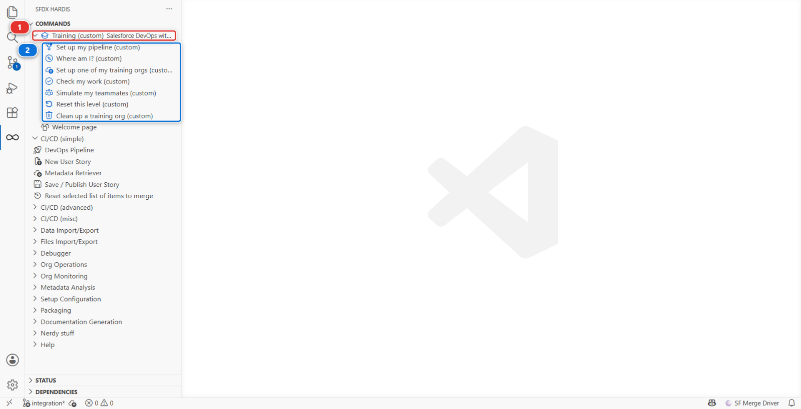

# Level 3 - Release Manager

**Time**: about 6 h.

**Before you start**: [Level 1](../level-1/index.md) **and** [Level 2](../level-2/index.md). Both
are required, and the badge audit checks both before it looks at anything here.

## Why Level 2 is not optional

A release manager reviews other people's deployment errors, deployment actions and conflicts. Those
are exactly what Level 2 puts you through. Somebody who has never solved a deployment error cannot
judge whether a contributor solved theirs properly, and the reviews they give will be about
formatting.

If you skipped Level 2, do it. It is seven hours and it is the difference between approving Pull
Requests and understanding them.

## The story

Sofia Marchetti left. She was the release manager, she set the pipeline up two years ago, and she
never finished it.

What you inherit works, in the sense that contributors deliver into `integration` every day. What
it does not have:

- **No UAT and no production in the pipeline.** The branches exist. Nothing deploys to them
- **No proper CI authentication.** There is one refresh-token secret somebody added in a hurry
- **No monitoring.** Nobody finds out about a problem in production until a user calls
- **No release notes and no metrics.** Nobody can say what shipped last month or how long it took
- **No generated documentation.** The org is two years old and the only description of it is Sofia

Your first week is finishing the pipeline. Then you run it.

## The Training menu

Everything this course asks you to run outside the product's own buttons lives in one menu, and it
is worth knowing where before you need it. Open the **SFDX HARDIS** view in the left bar of VS Code
and expand **Training (custom)** **(1)**:

Seven commands **(2)**, and the labs call them by these names:

| Command                            | What it does                                                  |
|------------------------------------|---------------------------------------------------------------|
| **Set up my pipeline**             | Forks the repository, turns Actions on, gives the CI a way in |
| **Where am I?**                    | Says which level and lab you reached, and what to do next     |
| **Set up one of my training orgs** | Deploys the Helios app and its data into an org you choose    |
| **Check my work**                  | Verifies the lab you just finished and prints your receipt    |
| **Simulate my teammates**          | Creates the teammate branches and Pull Requests a lab needs   |
| **Reset this level**               | Puts your repository back to the start of a level             |
| **Clean up a training org**        | Removes the Helios app and its data from an org               |

The same seven are on the **Welcome page**, as a card called **Training**. Either route runs the
same thing.

## What you will do

| Lab                                | Title                                                  | Time   |
|------------------------------------|--------------------------------------------------------|--------|
| [0](lab-00-finish-the-pipeline.md) | Your pipeline stops at integration: finish it          | 30 min |
| [1](lab-01-ci-auth.md)             | Wire CI authentication for three orgs                  | 40 min |
| [2](lab-02-review-pr.md)           | Review and merge a contributor Pull Request            | 25 min |
| [3](lab-03-deploy-integration.md)  | Deploy to integration and read what happened           | 25 min |
| [4](lab-04-overwrite-cleaning.md)  | Three Pull Requests collide                            | 35 min |
| [5](lab-05-uat-release-notes.md)   | Promote integration to UAT and write the release notes | 35 min |
| [6](lab-06-production.md)          | Ship to production and read your DORA metrics          | 35 min |
| [7](lab-07-hotfix-retrofit.md)     | Production is broken: hotfix and retrofit              | 35 min |
| [8](lab-08-monitoring.md)          | Put production under monitoring                        | 35 min |
| [9](lab-09-documentation.md)       | Generate the project documentation                     | 20 min |
| [10](lab-10-capstone.md)           | Capstone: run one full weekly release cycle            | 45 min |

## Two more orgs

Levels 1 and 2 needed two orgs. This level needs four.

Before Lab 0, sign up for two more free Developer Edition orgs at
[developer.salesforce.com/signup](https://developer.salesforce.com/signup), connect them in **Orgs
Manager** with the aliases `helios-uat` and `helios-prod`, and seed each one with
**Training > Set up one of my training orgs**.

`helios-prod` gets the same sources as the other three, plus one thing the seeding adds by hand: a
`Needs Reinspection` value on the `Installation__c.Status__c` picklist, which exists in no branch.
That is what Lab 7 retrofits. Nothing seeds a deployment history, so the DORA report in Lab 6 sees
only the deployments you make yourself.

## Keep MY-PIPELINE.md open

More than half the labs here ask you to write a line in it, and the badge audit reads it. It is the
document that says how this pipeline was put together, which is precisely what Sofia did not leave
you.

[Start with Lab 0](lab-00-finish-the-pipeline.md){ .md-button .md-button--primary }
