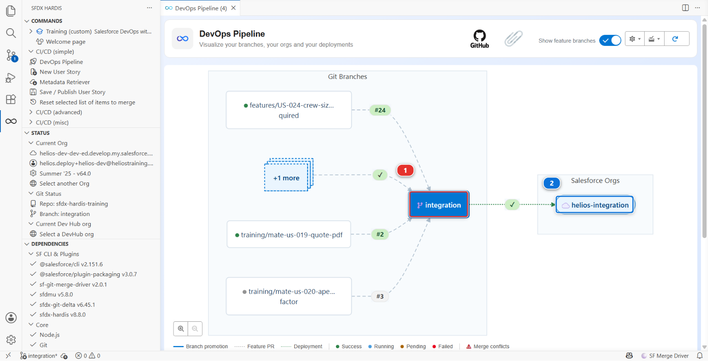
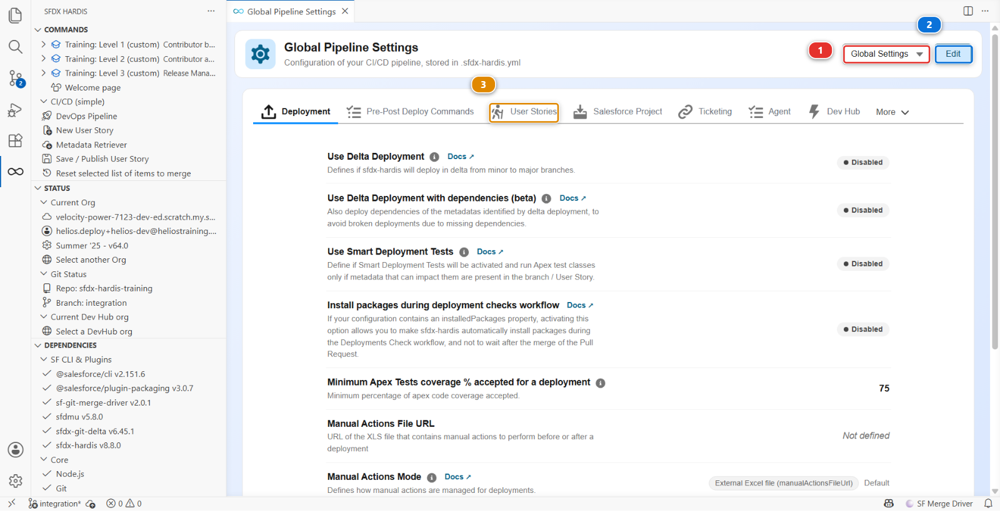
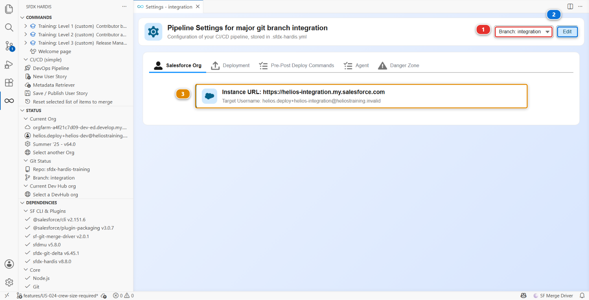

# Lab 0 - Your pipeline stops at integration: finish it

**Level**: 3 Release Manager

**Time**: ~30 min

**You will**: turn a one-stage pipeline into a three-stage one, and understand every line of
configuration you add.

## The situation

Open the **DevOps Pipeline** panel and look at what Sofia left.



One column. `integration` **(1)**, with its org **(2)**. The `uat` and `main` branches exist in git,
and nothing knows about them: no org, no merge path, no deployment job.

The panel says so itself, in the warnings at the bottom **(3)**:

> No merge target defined for branch integration
>
> No encrypted certificate key file found for branch 'integration'

Those two lines are your first week. The first is this lab, the second is the next one.

That is not unusual. Most projects start with one shared org because that is all they need on day
one, and finishing the pipeline gets postponed until the day somebody needs to release.

## Before you start

- [ ] Levels 1 and 2 finished
- [ ] Four orgs connected in **Orgs Manager**: `helios-dev`, `helios-integration`, `helios-uat`,
      `helios-prod`
- [ ] `helios-uat` and `helios-prod` seeded with **Training > Set up one of my training orgs**

## Steps

### 1. Decide the shape before you type anything

Three questions, and their answers are the whole pipeline:

| Question                                                                     | Helios answer                                                      |
|------------------------------------------------------------------------------|--------------------------------------------------------------------|
| Which branches are **major**, meaning they have an org and a deployment job? | `integration`, `uat`, `main`                                       |
| Which branch can merge into which?                                           | `integration` into `uat`, `uat` into `main`. Nothing skips a stage |
| Which branch is production?                                                  | `main`                                                             |

Write those three lines in `MY-PIPELINE.md` now, before you configure anything. If you cannot state
them in one sentence each, configuring them will not help.

### 2. Declare uat and main as targets

Open the **DevOps Pipeline** panel, then its settings menu at the top right, and **Pipeline
Settings**. The page title reads **Global Pipeline Settings**, and the configuration scope selector
**(1)** reads **Global Settings**.



The panel is read-only until you click **Edit** **(2)**, so click it first. Then open the **User
Stories** tab **(3)**, one of the ten tabs of the global scope, where the contribution settings live.

Two fields matter here, and they are **two separate text boxes, one value per line**:
**Available PR/MR target branches** and **Labels for available PR/MR target branches**. Nothing
pairs them except their order, so line 2 of one belongs to line 2 of the other. Get the order wrong
and contributors see the wrong description next to the right branch, with no error anywhere.

| Line | Branch      | Label                                                                 |
|------|-------------|-----------------------------------------------------------------------|
| 1    | integration | `integration: shared integration org, where every contributor merges` |
| 2    | uat         | `uat: user acceptance, only a release manager targets this`           |
| 3    | main        | `main: production, hotfixes only`                                     |

**Save**.

!!! note "Looking for the production branch?"
    You will not find it on this screen. `productionBranch` has no field in the settings panel,
    and this project already carries it:

    ```yaml
    productionBranch: main
    ```

    Open `config/.sfdx-hardis.yml` and read the Pipeline block to see it. A panel that covers most
    of a configuration and not all of it is normal, and it is why the under the hood sections of
    this course keep showing you the file. The file is the truth; the panel is a convenience over
    it.

### 3. Give uat and main their orgs

Refresh the pipeline diagram and `uat` and `main` are still not on it. Declaring them as target
branches told the contribution screen they exist. It did not make them major branches.

**A branch becomes major by having a file in `config/branches/`, and no screen creates the first
one.** The scope selector only lists branches that already have such a file, so `Branch: uat` is not
in it yet, and the panel cannot bootstrap itself out of that.

So write the two files by hand, next to the `integration` one that is already there:

    config/branches/.sfdx-hardis.uat.yml
    config/branches/.sfdx-hardis.main.yml

with two keys each. Get the usernames from **Orgs Manager**, and check them twice: pointing `main`
at the wrong org is the single most expensive mistake available in this lab.

| Branch | `targetUsername`               | `instanceUrl`                  |
|--------|--------------------------------|--------------------------------|
| uat    | the `helios-uat` org username  | `https://login.salesforce.com` |
| main   | the `helios-prod` org username | `https://login.salesforce.com` |

Now reopen **Pipeline Settings**. The scope selector **(1)** offers `Branch: uat` and `Branch: main`,
and picking one changes the title to **Pipeline Settings for major git branch uat**. Click **Edit**
**(2)** and the two fields of the **Salesforce Org** tab **(3)** hold what you just wrote:



Before **Edit**, that tab shows one summary card reading `Instance URL` and `Target Username` rather
than two editable fields. That is the view mode, not a missing setting.

The next lab writes these same two keys for you, as a side effect of configuring CI authentication.
Doing it by hand once is how you know what it wrote.

### 4. Declare the merge path

Still in the branch settings, on the **Deployment** tab of the same panel, set **Merge target
branches**, one value per line:

| Branch      | Merge targets |
|-------------|---------------|
| integration | `uat`         |
| uat         | `main`        |
| main        | none          |

**Save**.

This is what stops a contributor opening a Pull Request straight from a feature branch into
production. It is not a permission, it is a guardrail, and it exists because the alternative is
someone doing it at 18:00 on a Friday.

### 5. Look at the diagram again

Refresh the panel. Three columns, each with its org, connected by arrows in one direction.

That diagram is now the truth about this project, and it is the thing you will point at in every
conversation with a stakeholder who asks "so where is it".

<details markdown="1"><summary>Under the hood: the files you just wrote</summary>

`config/.sfdx-hardis.yml` gained:

    availableTargetBranches:
      - integration
      - uat
      - main
    availableTargetBranchesLabels:
      - "integration: shared integration org, where every contributor merges"
      - "uat: user acceptance, only a release manager targets this"
      - "main: production, hotfixes only"
    productionBranch: main

and the two files you wrote under `config/branches/` now hold `targetUsername`, `instanceUrl` and
`mergeTargets`.

**A major branch is not declared anywhere as "major".** It becomes one by having a branch
configuration file with an org in it. That is the whole mechanism, and knowing it means you can read
any sfdx-hardis project in two minutes by listing `config/branches/`. It is also why step 3 started
in a text editor: every screen that reads major branches, the pipeline diagram and the scope
selector included, is reading that folder, so none of them can show you a branch that has no file
there yet.

One more thing worth knowing about the panel: at branch scope it only writes what differs from the
global configuration. A value you type that happens to equal the global one is silently not written,
and you get a file that looks like it lost your edit.

### What `sf hardis:project:create` would have done

Had Helios started today, the skeleton would have been generated rather than assembled:

    sf hardis:project:create

which asks for the type of development orgs, the project name, **one** development branch and the
cleaning types, connects a DevHub, runs `sf project generate`, then copies the default CI files over
the result: the workflows for **every** git provider at once, `manifest/package-no-overwrite.xml`,
`.mega-linter.yml` and friends. It writes `projectName`, `developmentBranch` and `autoCleanTypes`
into `config/.sfdx-hardis.yml`.

It does **not** write a single `config/branches/` file, and it never asks for an org other than the
DevHub. The branch files are the next lab's command, or your text editor. So generating the project
would have saved you the skeleton and left you exactly the work you have just done.

The other command worth knowing about is `sf hardis:org:retrieve:sources:dx`, which takes an
existing org with no repository at all and produces the initial commit. That is the real starting
point of most projects: not an empty repository, but a two-year-old org nobody has ever versioned.

</details>

### 6. Commit the configuration

This is configuration, so it goes through the same pipeline as everything else. Commit it on a
branch, open a Pull Request into `integration`, and merge it.

Yes, even as the release manager. Especially as the release manager.

## What you should see

- Three columns in the DevOps Pipeline panel, each naming its org
- `config/branches/` holding three files
- A merged Pull Request carrying the configuration change

## If it goes wrong

**The uat column appears with no org even after saving.**
The file was written for a different branch name. Check `config/branches/` for a typo: the file name
has to match the branch exactly.

**The pipeline diagram does not refresh.**
Click **Refresh pipeline data** in the panel. It caches the git state.

**You pointed a branch at the wrong org.**
Fix the branch configuration file and commit again. Nothing has deployed yet, so nothing is broken.

## Check your work

Welcome page > **Training** > **Check my work**, then pick level 3 and lab 0.

## Go deeper

- [Setup Guide](https://sfdx-hardis.cloudity.com/salesforce-devops-setup-home/)
- [Initialize the SFDX project](https://sfdx-hardis.cloudity.com/salesforce-devops-setup-init-project/)
- [Retrieve an existing org](https://sfdx-hardis.cloudity.com/salesforce-devops-setup-existing-org/)

[Next: Lab 1 - Wire CI authentication for three orgs](lab-01-ci-auth.md){ .md-button .md-button--primary }
