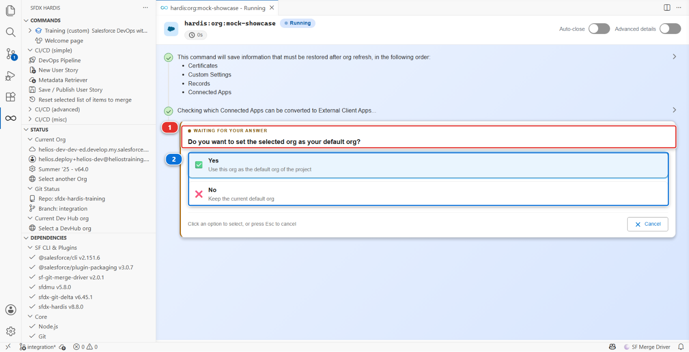
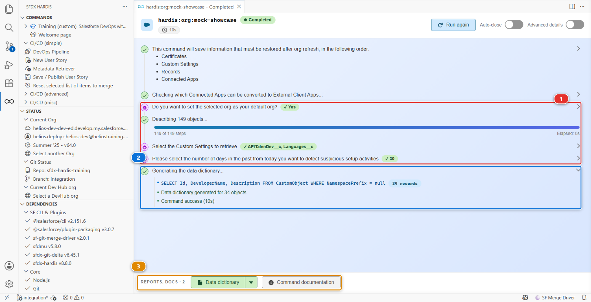

# Lab 1 - Wire CI authentication for three orgs

**Level**: 3 Release Manager
**Time**: ~40 min
**You will**: replace the shortcut Level 1 gave you with the credential a real project uses, for all
three orgs, and delete the shortcut.

## The situation

Your CI reaches `helios-integration` through `SFDX_AUTH_URL_INTEGRATION`, a secret containing a
long-lived OAuth refresh token. Level 1 told you it was a deliberate exception for a throwaway org
and that you would fix it here.

This is here.

Three things are wrong with an auth URL on a real project, and they are worth being able to say out
loud because somebody will ask you why you are spending an hour on this:

1. **It cannot be rotated.** Changing it means authenticating interactively again, as a human, in a
   browser. There is no unattended rotation
2. **It is a bearer credential with no scope.** Anyone who reads the secret has everything that user
   has, from anywhere, until it is revoked
3. **It is tied to a person.** When that person leaves or their password policy resets their token,
   the pipeline stops, and nobody knows why

The alternative is a **JWT flow through an External Client App**: a certificate you hold, a
pre-authorised user, no password anywhere, and revocation by deleting one app.

## Before you start

- [ ] Lab 0 finished: three major branches with their orgs
- [ ] All four orgs connected in **Orgs Manager**
- [ ] `openssl` available (it ships with Git for Windows, macOS and Linux)

!!! note "This lab is about the CI, not your workstation"
    Your own connection to these orgs already exists and is not changing. Orgs Manager keeps
    working exactly as before. What you are setting up is how a **GitHub runner**, which is not you
    and has no browser, reaches the org.

## Steps

### 1. Run the configuration command for integration

In the **DevOps Pipeline** panel, open the settings menu (the gear, top right) and click
**Add/Configure Org**.

The command runs in a panel rather than a terminal, and asks one question at a time **(1)**, with
the answers to click below it **(2)**.



It asks a dozen questions, not three, and the order is not the one you would guess:

1. **Which org?** - select or log into `helios-integration`
2. **Which git branch do you want to configure deployments from?** - `integration`. The list is
   built from your **remote** branches, and branches whose name contains a `/` are filtered out of
   it
3. **What is the base URL or domain?** - `https://login.salesforce.com`. **The highlighted answer is
   the sandbox one**, so this is a question to read rather than confirm
4. **Which target branches can this one merge into?** - `uat`. This writes `mergeTargets` again, on
   top of what you set in Lab 0, so give the same answer
5. **Which Salesforce username will the CI server deploy as?** - the `helios-integration` username
6. **How do you want to provide the SSL certificate?** - self-signed. The other answer, CA-signed,
   generates nothing at all and only prints instructions
7. **Do you want sfdx-hardis to configure the External Client App?** - yes
8. **Which JWT certificate storage mode?** - **ClientId + decryption key as secret variables +
   encrypted certificate as file**, the default. The other mode puts the certificate itself in a
   third secret and deletes the file
9. **Please confirm when variables have been set.** This one is a stop, and step 3 is what it is
   waiting for. Do not answer yes yet
10. Then, after you confirm: the **name** of the External Client App, a **contact email**, and the
    **profile to pre-authorise** (`System Administrator`)

### 2. Read what it produced, and copy the two values

The panel keeps every question you answered **(1)**, so you can check what you told it without
starting again. Before question 9 it prints the two values you are about to store **(2)**. Nothing
prints them again, so do not close the panel or scroll past them. The files it wrote are listed in
the reports bar at the bottom **(3)**.



What it writes, and where:

| What                              | Where                                                                   | What it is                                                     |
|-----------------------------------|-------------------------------------------------------------------------|----------------------------------------------------------------|
| An encrypted private key          | `config/branches/.jwt/integration.key`                                  | The credential itself, meant to be committed                   |
| A certificate                     | `integration.crt` in your home directory, deleted after the app deploys | What is uploaded into the org                                  |
| An External Client App definition | deployed into the org by the command                                    | What Salesforce authenticates against                          |
| Branch configuration              | `config/branches/.sfdx-hardis.integration.yml`                          | `targetUsername`, `instanceUrl` and `mergeTargets`             |
| Two values to store as secrets    | printed in the command panel                                            | `SFDX_CLIENT_ID_INTEGRATION` and `SFDX_CLIENT_KEY_INTEGRATION` |

The consumer key is **not** written to the branch configuration. It lives in the org and in your
secret, and nowhere else in the repository.

The private key committed to the repository is **encrypted**, with a passphrase the command
generates at random and holds as `SFDX_CLIENT_KEY_INTEGRATION`. The repository alone is not enough
to authenticate, which is what makes committing it acceptable.

### 3. Store the secrets in your fork

Do this now, while question 9 is still waiting.

In your fork: **Settings > Secrets and variables > Actions > New repository secret**, twice:

| Name                          | Value                                |
|-------------------------------|--------------------------------------|
| `SFDX_CLIENT_ID_INTEGRATION`  | the consumer key the command printed |
| `SFDX_CLIENT_KEY_INTEGRATION` | the passphrase the command printed   |

The `<ALIAS>` suffix is **the branch name in upper case**. That is the entire convention, and it is
why the names are not arbitrary.

Now answer yes to question 9, and let the command create the app.

### 4. Check the org authorisation it did for you

The step everybody warns you about, pre-authorising the app, is the one the command already did.

The External Client App it deploys carries `Admin approved users are pre-authorized` and the profile
you named at the last question, which is why that question exists. Go and look at it once, so you
know where it is when it matters:

In `helios-integration`: **Setup > External Client App Manager > sfdx-hardis > Policies**. Permitted
Users reads *Admin approved users are pre-authorized*, and the profile is listed.

It matters because of the one path where it is **not** done for you: if the app deployment fails and
the command falls back to printing manual instructions, those instructions stop at uploading the
certificate. They say nothing about permitted users or profiles. Follow them literally and the first
CI login fails with `user hasn't approved this consumer`, which is an accurate message that reads
like a bug.

### 5. Do the same for uat and main

Run the command twice more, once for each branch and org. Store four more secrets:

- `SFDX_CLIENT_ID_UAT`, `SFDX_CLIENT_KEY_UAT`
- `SFDX_CLIENT_ID_MAIN`, `SFDX_CLIENT_KEY_MAIN`

The command pre-authorises each app as it creates it, so there is nothing to do in Setup unless a
deployment failed.

Six secrets, three External Client Apps, three certificates. Tedious once, then never again.

### 6. Prove it works before you delete anything

Start with `uat`, because it is the one that can be proven right now. Open a Pull Request from
`integration` into `uat` and watch the check job authenticate. That branch has no auth URL secret to
fall back on, so a green authentication there is a JWT authentication and nothing else. Do not merge
it yet, Lab 5 is the real promotion.

**`integration` cannot be proven the same way, and that is the point of this step.**
`SFDX_AUTH_URL_INTEGRATION` still exists, the authentication hook looks for it first, and it stops
there. Push a trivial commit to `integration` and the log shows an auth URL login, not a JWT one, no
matter how correct your certificate is.

So there is nothing you can check on `integration` while the shortcut is there. Which is why the
next step is a test and not a formality:

### 7. Delete the shortcut

In your fork: **Settings > Secrets and variables > Actions**, find `SFDX_AUTH_URL_INTEGRATION`, and
delete it.

Push another commit and watch the job still pass. If it does, the JWT path is genuinely what is
being used, and it was not quietly falling back.

### 8. Write down why

In `MY-PIPELINE.md`, under Level 3:

```markdown
- **Lab 1, CI authentication**: deleted the SFDX_AUTH_URL_INTEGRATION secret. It carried a
  long-lived refresh token that could not be rotated, was not scoped, and was tied to one person.
  All three orgs now authenticate with JWT through an External Client App.
```

The badge audit looks for that line. More to the point, it is the answer to the question the next
release manager will ask.

<details markdown="1"><summary>Under the hood: what the JWT flow actually does</summary>

The command ran:

    sf hardis:project:configure:auth

and the CI job now runs, before anything else:

    sf org login jwt \
      --client-id $SFDX_CLIENT_ID_INTEGRATION \
      --jwt-key-file <decrypted key> \
      --username <targetUsername from the branch config> \
      --instance-url <instanceUrl from the branch config> \
      --alias integration

The private key is decrypted at the start of the job with `SFDX_CLIENT_KEY_INTEGRATION`, used, and
never written anywhere persistent.

**How the authentication hook chooses.** For a branch `<B>`, it looks for `SFDX_AUTH_URL_<B>` first,
in that spelling and then upper-cased. If it finds one, it uses it and returns, before the JWT
variables are even read. Only if there is none does it go on to `SFDX_CLIENT_ID_<B>` plus the
certificate. That order is why step 7 is a real test: while the auth URL secret existed, the JWT
path was never being exercised.

One detail worth knowing before you debug this on a real project: the JWT lookup also accepts a
plain `SFDX_CLIENT_ID` with no suffix, as a last resort and with a warning in the log. A single
unsuffixed secret left over from an old setup will answer for every branch.

`orgAuthenticationMode` in `config/.sfdx-hardis.yml` is **not** written by this command, and no CLI
command reads it. It is a key you set by hand, and it only tells the VS Code pipeline panel which
shape to expect, so that it can warn you when a major org is not configured the way the project
declared. The default it assumes is `encryptedCert`, which is what you have just built.

</details>

## What you should see

- Six secrets in your fork, none of them an auth URL
- Three `config/branches/.jwt/*.key` files, encrypted
- A green check job on the Pull Request into `uat`, authenticating with JWT
- `SFDX_AUTH_URL_INTEGRATION` gone, and `integration` still deploying green after it went

## If it goes wrong

**`user hasn't approved this consumer`.**
Step 4. The External Client App exists but the user is not pre-authorised.

**`invalid_grant: audience is invalid`.**
The instance URL does not match the org type. A Developer Edition org uses
`https://login.salesforce.com`, never `test.salesforce.com`.

**The job cannot decrypt the key.**
`SFDX_CLIENT_KEY_<ALIAS>` is wrong or was copied with a trailing newline. Recreate it.

**Everything passes even with the JWT secrets missing.**
The auth URL secret is still there and still winning. That is exactly what step 7 catches.

## Check your work

Welcome page > **Training** > **Check my work**, then pick level 3 and lab 1.

## Go deeper

- [Configure CI authentication](https://sfdx-hardis.cloudity.com/salesforce-devops-setup-auth/)
- [GitHub Actions authentication](https://sfdx-hardis.cloudity.com/salesforce-devops-setup-auth-github/)

[Next: Lab 2 - Review and merge a contributor Pull Request](lab-02-review-pr.md){ .md-button .md-button--primary }
