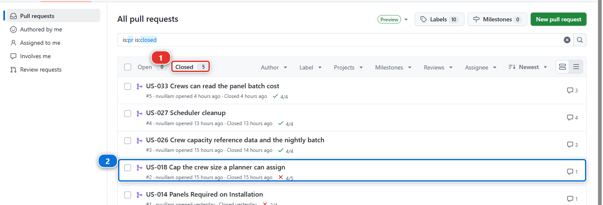
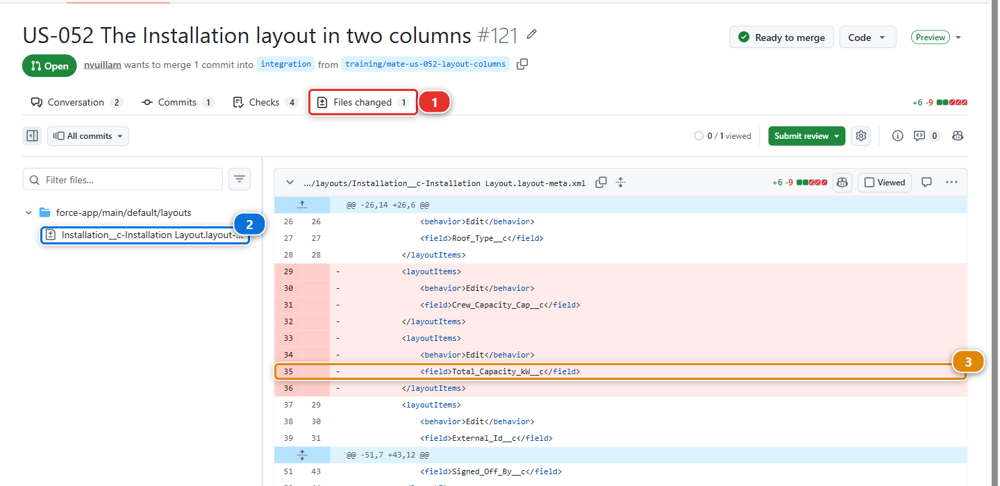
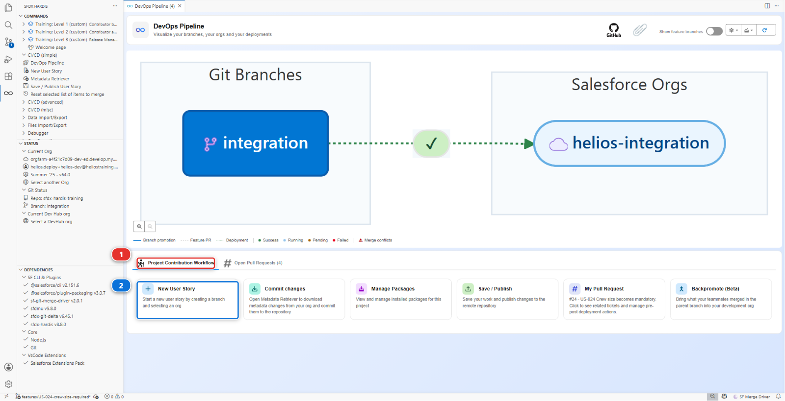

# Lab 2 - Review and merge a contributor Pull Request

**Level**: 3 Release Manager

**Time**: ~25 min

**You will**: review somebody else's work, find the thing the robot did not, ask for a change, and
merge.

## The situation

Marco's **US-018 - Cap the crew size a planner can assign** is already in `integration`. You merged
it yourself, in Level 2 lab 6, after the review that lab called "brief". The checks were green, the
sfdx-hardis comment said the deployment validated and the tests passed, and you moved on because you
had a conflict of your own to resolve.

Green checks mean "this will deploy". They do not mean "this is right". Deciding the second is your
job now, and it is the part of release management that cannot be automated.

This lab is the review you did not do. It is a better lesson than a fresh Pull Request would have
been, because the thing you missed is in your integration org right now.

## Before you start

- [ ] Lab 1 finished: JWT authentication on all three orgs
- [ ] A clean working tree

!!! note "Do not re-run Simulate my teammates for US-018"
    Each teammate scenario is used once. Level 2 lab 6 consumed this one, and running it again
    replays the same files onto a branch that already has them, so it reports "Nothing to commit"
    and opens nothing. The Pull Request you need is already in your fork, merged.

## Steps

### 1. Find Marco's Pull Request in your fork

In your fork: **Pull requests**, then the **Closed** filter **(1)**, and open **US-018 Cap the crew
size a planner can assign** **(2)**.

A merged Pull Request keeps everything a review needs: the diff, the checks, the sfdx-hardis
comment. The only thing it no longer offers is the Merge button.

!!! note "The red cross on that row"
    The counter next to each row is *checks passed / checks run*, all of them, and on this project
    one of them is **Mega-Linter** over the whole repository. It fails on Marco's story the same way
    it reported a finding on yours in Level 1: it is looking at code nobody in this course wrote.
    Both deployment checks passed, which is the point of this lab: the pipeline was happy.

### 2. Read the robot first

Read the sfdx-hardis comment, top to bottom. Four things, in this order:

1. **Did it deploy?** The comment is titled *Validation Results (deployment simulation)* on a check
   job, *Deployment Results* on a merge job. The Salesforce deployment id is not printed anywhere in
   it: it is carried as an invisible HTML marker, which is how the next run finds this comment again
2. **How much does it deploy?** Not a list. One line of counts: how many components were sent, how
   many changed, and how many of those were created, updated, deleted or left unchanged. If the
   counts do not match the size of the story, that is your cue to go and read the diff
3. **What does it delete?** The `deleted` count on that same line, plus a **Flow changes** table
   when a Flow is involved. There is no separate destructive changes section, so a deletion that is
   not a Flow shows up as one number and nothing else. That is worth knowing before you rely on the
   comment to catch one
4. **Tests and coverage.** Coverage always, with the test classes folded into a collapsed block.
   Failures only when there are failures

Reading it in that order takes two minutes. It also tells you what the comment cannot do for you,
which is step 3.

### 3. Read the diff, looking for what the robot cannot see

The robot checks that the deployment works. It cannot check that the deployment is a good idea.

Go through Marco's diff file by file with four questions:

| Question                                 | Why it matters                                                                                                        |
|------------------------------------------|-----------------------------------------------------------------------------------------------------------------------|
| **Does this match the story?**           | Compare with US-018 in the backlog. Extra changes are either scope creep or an accident, and both are worth a comment |
| **Does anything disappear?**             | A removed field, a removed picklist value, a removed permission. Salesforce will happily deploy a deletion            |
| **Are permissions on a Permission Set?** | A Profile carrying field permissions means somebody bypassed the convention                                           |
| **Would this be reversible?**            | If this turns out wrong in production on Friday, what is the path back?                                               |

### 4. Find the one the robot missed

In Marco's diff, the flow now reads `Installation__c.Crew_Capacity_Cap__c`, and the permission set
grants it. Both fine.

Now open `Installation__c-Installation Layout.layout-meta.xml`. Marco added his cap field to the
layout, and `Total_Capacity_kW__c` went with it.

Nothing fails. The field still exists, the deployment was green, the tests passed. But nobody can
see a capacity on an installation record any more, and the first person to notice will be whoever
reads that number on a Monday morning.

Then count the lines. Marco did not edit the layout, he **replaced the file** with the one he had,
and the one he had did not know about the fields Level 1 delivered. Check your own diff for what
else left with `Total_Capacity_kW__c`: on a standard run of this course, `Panels_Required__c` and
`Crew_Notes__c` are in there too. Three fields off a layout, in a story about a crew cap.

**Nothing in the pipeline can catch that.** A whole-file replacement is a valid deployment, the
counts line says `updated: 1`, and only somebody who knows the org can see what is missing.

### 5. Say what you found, where it will be found again

The Merge button is gone, and so is **Request changes**: you cannot ask for changes on a Pull
Request you already merged. What you can still do is leave the comment, and that is not a
consolation prize. A review comment on a merged Pull Request is where the next person looks when
they ask why the layout changed.

Click **Files changed** **(1)**. The file tree on the left lists the four files Marco's story
touched, and the layout **(2)** is the one to open.

Find the layout in the diff, hover the line where the field used to be, click the blue **+** that
appears, and comment:

> `Total_Capacity_kW__c`, `Panels_Required__c` and `Crew_Notes__c` came off the layout with this
> change, because the file was replaced rather than edited. They are still on the object. I am
> putting them back in a follow-up, second column, so the cap keeps its place.

Two things about that comment worth copying:

- **It says why**, so the reader can judge rather than take your word
- **It says what happens next**, so nobody has to ask

### 6. Fix it yourself, through the pipeline

The story is merged, so the fix is a story of its own. This is the ordinary path, and you already
know it from Level 1: **New User Story** **(2)**, under **Project Contribution Workflow** **(1)**,
targeting `integration`.

Then put the three fields back on the layout beside the cap field, in the second column that the
layout already has and does not use, retrieve the layout, commit it, and publish.

Publish, open the Pull Request, and let the checks run. When they are green: **Review changes >
Approve**, then **Merge pull request**.

Use **Create a merge commit**, not squash. On a pipeline where the release notes and the DORA report
are built from merged Pull Requests, the merge commit is what carries the link back to the Pull
Request, and squashing loses it.

### 7. Delete the branch

GitHub offers the button. Take it.

Under the hood: what produced the comment you just read

The check job ran:

    sf hardis:project:deploy:smart --check

and then posted the comment through the GitHub API with the token the workflow already has.

**The comment is updated in place** on every push rather than added again, which is why the Pull
Request does not fill up with twenty robot comments. It finds itself again through a hidden marker
carrying a message key, and there are in fact **two** such comments, each updated independently: one
for the check job, one for the merge job.

The counts it prints come from the package the deployment computed, not from the git diff. The two
can differ, and when they do the package is the truth: it is what Salesforce will receive.

Deletions are the weak spot. `hardis:work:save` writes `manifest/destructiveChanges.xml` when a
contributor removes something, and a contributor can produce one **without meaning to**, by
unticking something in the selection screen after it was committed. The comment gives that a number
in the counts line, and a table only when Flows are involved. If a Pull Request's counts show
anything deleted, the comment has told you everything it is going to: the rest is the diff.

## What you should see

- A review comment on Marco's merged Pull Request, naming what came off the layout
- A follow-up Pull Request of yours, reviewed and merged into `integration`
- `Total_Capacity_kW__c` back on the Installation layout in `integration`

## If it goes wrong

**Simulate my teammates says "Nothing to commit".**
Expected, and it is why step 1 does not use it. Level 2 lab 6 already merged US-018, and each
scenario is used once.

**The checks never run on your follow-up Pull Request.**
Actions are disabled, or the JWT secrets are missing for `integration`. Lab 1.

**The layout fields are already back.**
Then you or a teammate restored them earlier. Say so in `MY-PIPELINE.md` and move on: the lesson is
the comment, not the commit.

## Check your work

Welcome page > **Training: Level 3** > **Check my work**, then pick lab 2.

## Go deeper

- [Review and merge Pull Requests](https://sfdx-hardis.cloudity.com/salesforce-devops-validate-merge-request/)
- [Check the Pull Request results](https://sfdx-hardis.cloudity.com/salesforce-devops-handle-merge-request-results/)

[Next: Lab 3 - Deploy to integration and read what happened](lab-03-deploy-integration.md){ .md-button .md-button--primary }
