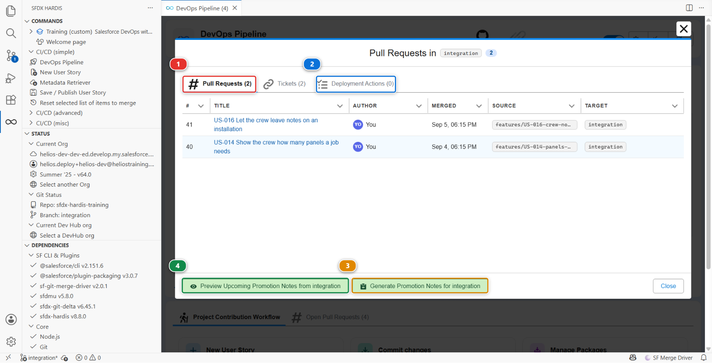
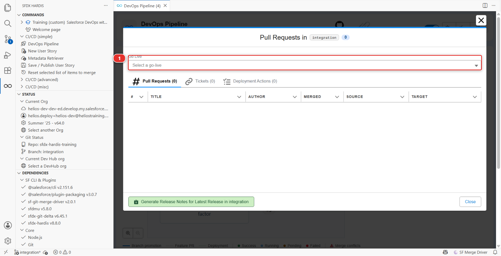

# Lab 5 - Promote integration to UAT and write the release notes

**Level**: 3 Release Manager

**Time**: ~35 min

**You will**: make your first promotion between two major branches, read the deployment actions it
carries, and produce the document the business actually reads.

## The situation

Everything the team built this week is in `integration`. The business testers work in UAT. Monday
morning they expect to find this week's work there, with a note saying what changed.

A promotion between major branches is not a contributor Pull Request. It carries several stories at
once, it may carry deployment actions declared weeks ago by different people, and the org it
deploys to has real testers in it.

## Before you start

- [ ] Lab 4 finished: US-018 and US-019 merged into `integration`
- [ ] `helios-uat` connected, seeded, and configured as the `uat` org in Lab 0
- [ ] JWT authentication working for `uat` (Lab 1)

## Steps

### 1. See what you are about to ship

Open the **DevOps Pipeline** panel and click the `integration` node in the diagram. A window opens
on that branch, titled **Pull Requests in integration**.

**Pull Requests** **(1)** is the list that matters: every Pull Request merged into `integration`
since the last promotion to `uat`, with who merged it and when. That list **is** the release. Read
it before you create anything: if a story in it should not go out this week, now is the moment, not
after the deployment.

**Deployment Actions** **(2)** is the list of actions those Pull Requests carried, gathered in one
place, and step 3 comes back to it. **Tickets** beside it is the same again for whatever ticketing
system the project declares. A fourth tab, **Apex Tests**, appears only on a project that sets
`enableDeploymentApexTestClasses`, and this one does not.

The footer holds the two buttons step 6 uses: **(3)** generates the notes for what has already been
promoted, **(4)** previews the notes for what has not.

!!! note "Empty, with a Go Live selector instead?"
    Then this branch has no merge target yet, and the panel is showing you its go-lives **(1)**
    rather than what is waiting to be promoted:

    

    Lab 0 of this level is what gives `integration` a merge target. Go back and finish it.

### 2. Create the promotion Pull Request

Create it on GitHub, from `integration` into `uat`, like any other Pull Request.

!!! note "There is no button for this in the panel, and that is correct"
    The branch window does have a **Create promotion from integration (experimental)** button, but
    it only appears when the project turns on `enablePromotionBranches`, which this one does not.
    That feature is for promoting a **subset** of what is waiting. What you are doing is promoting
    everything, and everything is what a plain Pull Request from one branch to the next carries.

Title it for the humans who will read it, not for git:

> Release 2026-09-3: crew capacity cap, quote PDF

### 3. Read the deployment actions it carries

Once the check runs, the sfdx-hardis comment gains a section headed **Post-deployment Actions
Results** (the merge job adds **Pre-deployment Actions Results** in the same shape). This is the part
of a promotion that has no equivalent in a contributor Pull Request.

Every action any contributor declared on any of the merged stories is collected into one table, with
its label, its type, its status and a link back to the Pull Request it came from. Anything needing a
human gets a **checklist above the table**, under a heading that says whether it happens before or
after the deployment.

**Read it before merging.** Two things to look for:

| What you see      | What it means for you                                                                                   |
|-------------------|---------------------------------------------------------------------------------------------------------|
| A **manual step** | Somebody has to click something in UAT. That somebody is you, and it will not happen unless you plan it |
| A **data import** | Records will be written to UAT. Testers may have their own records there                                |

You cannot edit a contributor's action from here: it belongs to their Pull Request and to every org
after this one, so a wrong action is fixed in a new Pull Request rather than in this promotion.

The checklist is the exception, and it is not decoration. **Tick a box once you have done the thing
in the org**, and the next sfdx-hardis job reads the box back and records the action as done. Leave
it unticked and the next promotion will still be asking you for it.

### 4. Merge and watch the deployment

Merge the promotion. The **Process Deployment (sfdx-hardis)** run starts, this time on `uat`.

This is the first deployment to this org through the pipeline, so it will be larger than the ones to
integration: UAT is behind by everything the team has done. Expect several minutes.

When it finishes, do the manual steps the comment listed, in `helios-uat`.

### 5. Verify with a tester's eyes

Open `helios-uat` and check the two stories are genuinely usable, not just deployed:

- Assigning a crew larger than the cap is refused
- The quote PDF permission is on the manager permission set

Deployed and usable are different states, and the gap between them is almost always a permission or
a piece of reference data.

### 6. Generate the release notes

Open the **DevOps Pipeline** panel and click the `uat` node, the same way you clicked `integration`
in step 1. In the footer of that window, the button marked **(3)** in the picture at step 1 now
reads **Generate Promotion Notes for uat**. Click it: it covers the promotion you have just
merged.

The button is named after what the branch is. `uat` still merges into `main`, so what arrived there
is a promotion. On a branch with no merge target, `main`, the same button reads **Generate Release
Notes for Latest Release in main**, and once you pick a go-live in the selector at the top of the
window it reads **Generate Release Notes for** that go-live.

Next to it, the button marked **(4)**, **Preview Upcoming Promotion Notes from uat**, does the same
thing for what has not been promoted yet. It is the one to use on a Wednesday, when somebody asks
what Thursday's release will contain.

You get a markdown document listing the Pull Requests, their authors, their stories and the manual
steps, generated from the merge history rather than from anybody's memory. It lands under
`hardis-report/release-notes/`, in a folder named after the version and the date, as markdown, PDF
and spreadsheet.

Read it and then improve it. Generated notes are a complete list, and a release note the business
reads needs two things the generator cannot know:

1. **One sentence at the top saying what this release is for.** "Crews can no longer be
   over-staffed, and sales can generate quote PDFs."
2. **The manual steps, stated as instructions to a named person**, not as a technical list

Put the result in the repository the way everything else gets there: **New User Story** targeting
`integration`, **Save / Publish User Story**, **Create Pull Request**. Then put its link in
`MY-PIPELINE.md`.

Under the hood: what generated the notes, and what a promotion really is

The command was:

    sf hardis:doc:release-notes --mode post --target-branch uat

which walks the git history between two references, collects the merge commits, matches each one
with its Pull Request through the git provider API, and pulls the title, author, body and declared
deployment actions.

**That API call is the part that can quietly fail.** The command needs a git provider token, taken
from the environment (`GITHUB_TOKEN` or `CI_SFDX_HARDIS_GITHUB_TOKEN` on GitHub). With no token it
does not stop: it warns, collects zero Pull Requests, and writes you a perfectly formatted document
with nothing in it. An empty release note is more often a missing token than an empty release.

**This is also why Lab 2 said not to squash.** A squashed merge loses the link between the commit and
the Pull Request, and both the release notes and the DORA report in Lab 6 lean on exactly that link.
A project that squashes everything has no release notes it did not write by hand.

**A promotion is an ordinary Pull Request.** There is no special promotion machinery in the default
setup: `integration` into `uat` is a branch merged into another branch, and the deployment job on
`uat` behaves like the one on `integration`. What differs is only what the configuration says about
`uat`: its org, its merge targets, and whether delta deployment applies between major branches
(`enableDeltaDeploymentBetweenMajorBranches`, off by default, because a promotion is the worst
moment to discover the target org drifted).

There is an experimental feature for teams who want to promote a **subset** of what is waiting,
rather than everything: [promotion
branches](https://sfdx-hardis.cloudity.com/salesforce-devops-promotion-branches/). It is worth
reading about once you have done a few releases the ordinary way.

## What you should see

- The `uat` branch carrying everything `integration` had
- A green **Process Deployment (sfdx-hardis)** run on `uat`
- Both stories working in `helios-uat`
- Release notes committed, and linked from `MY-PIPELINE.md`

## If it goes wrong

**The check fails with authentication errors for uat.**
Lab 1 for the `uat` branch: the secrets, and the pre-authorisation of the External Client App in
`helios-uat`.

**The deployment fails on something that worked in integration.**
The orgs differ. Usually UAT is missing a feature, a licence, or a component somebody deleted there
by hand. Read the error and check the org.

**The promotion Pull Request shows hundreds of files.**
That is expected on a first promotion: UAT is behind by the whole history. It settles after this
one.

**The release notes are empty.**
Three causes, in order of likelihood: no git provider token in the environment, so the Pull Request
lookup returned nothing and only warned; the merges were squashed, so there is no link to look up;
or the range is wrong.

## Check your work

Welcome page > **Training** > **Check my work**, then pick level 3 and lab 5.

## Go deeper

- [Deploy to major orgs](https://sfdx-hardis.cloudity.com/salesforce-devops-deploy-major-branches/)
- [Release Notes](https://sfdx-hardis.cloudity.com/hardis/doc/salesforce-devops-release-notes/)

[Next: Lab 6 - Ship to production and read your DORA metrics](lab-06-production.md){ .md-button .md-button--primary }
