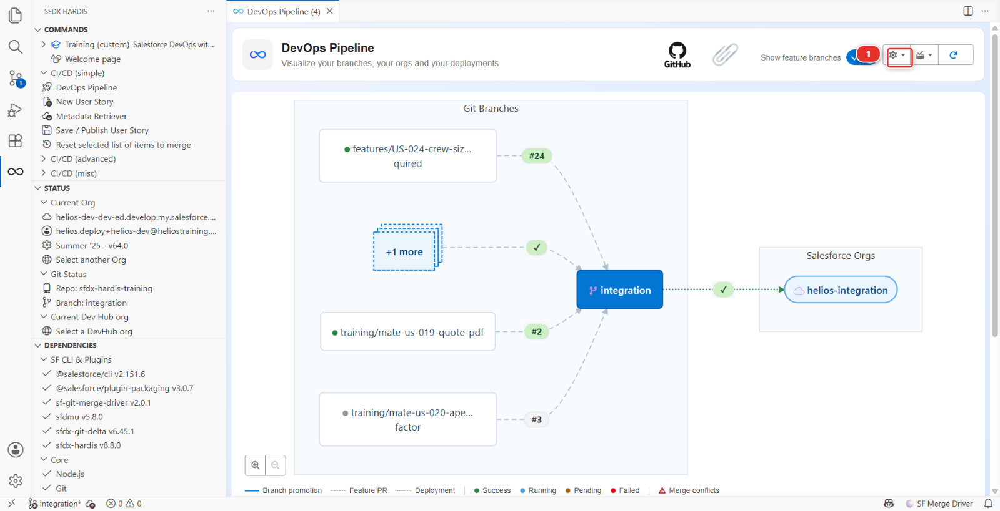

# Lab 6 - Ship to production and read your DORA metrics

**Level**: 3 Release Manager

**Time**: ~35 min

**You will**: release to production, and then measure whether your pipeline is any good.

## The situation

UAT signed off. The release goes to production this evening.

This is the same mechanism as Lab 5, with one difference that is not technical: if you get it wrong,
real people cannot do their jobs tomorrow. Everything in this lab that looks like ceremony is there
because somebody skipped it once.

## Before you start

- [ ] Lab 5 finished: `uat` carries the release and the testers signed it off
- [ ] `helios-prod` connected, seeded and configured as the `main` org
- [ ] JWT authentication working for `main`

## Steps

### 1. Check the three things that are worth checking

Before creating anything:

**One: is UAT genuinely signed off?** Not "the deployment was green". Somebody tested it and said
yes. On this project that person is you, and you did it in Lab 5 step 5.

**Two: what manual steps will this carry?** Look at the deployment actions of the stories going out.
A manual step in production is something you will do, live, in front of nobody, at whatever time the
release is. Know about it now.

**Three: is production where you think it is?** Open `helios-prod` and look. It carries the same
sources as the other orgs plus one thing an admin added by hand, which is what Lab 7 is about.
Assume nothing.

### 2. Create the production Pull Request

On GitHub, from `uat` into `main`, the same way you created the promotion in Lab 5. There is no
button for it in the panel unless the project turns on promotion branches, and this one does not.

Title it plainly:

> Release 2026-09-3 to production

### 3. Read the check like it matters

When the check finishes, read the sfdx-hardis comment the way Lab 2 taught, and add two questions
that only apply to production:

| Question                     | Where to look                                                                                                               |
|------------------------------|-----------------------------------------------------------------------------------------------------------------------------|
| **Does it delete anything?** | The destructive changes section. A deletion in production is permanent and takes data with it                               |
| **How long will it take?**   | The check duration is a reasonable estimate. If it is 40 minutes, that is 40 minutes during which the org is being modified |

If the destructive changes section is not empty and you were not expecting it, **stop**. Find out
what it is and who intended it. That is not being careful, that is the job.

### 4. Merge, and stay

Merge. The **Process Deployment (sfdx-hardis)** run starts, this time on `main`.

Watch it. Not because you can do anything while it runs, but because knowing whether it failed at
minute two or minute thirty-five changes what you do next.

When it finishes, do any manual steps, then check the org.

### 5. Verify in production

Same as UAT, with more care:

- The two stories work
- Something that was already working still works: open an installation, check the timeline
  component, save a record

That last check exists because the most common production incident after a release is not the new
feature failing. It is an old one.

### 6. Now measure the pipeline

You have shipped. The question a release manager gets asked next is "how are we doing", and it
deserves a better answer than a feeling.

**Point yourself at `helios-prod` first.** Open **Orgs Manager**, find the `helios-prod` row, and
choose **Set as Default Org** in its actions menu. The report measures whatever org you are pointed
at: run it while `helios-dev` is your current org and you get a report about your sandbox, correctly
formatted and completely irrelevant.

Then open the **DevOps Pipeline** panel, open the gear menu at the top right **(1)**, and choose
**Generate DORA Metrics Report**. It sits in the same menu as **Pipeline Settings**, which you used
in Lab 0.



It covers the last 90 days by default, and it reports five numbers, not four:

| Metric                    | What it actually counts                                                      | What good looks like                                              |
|---------------------------|------------------------------------------------------------------------------|-------------------------------------------------------------------|
| **Deployment frequency**  | Successful deployments recorded **in the org**, divided by the period        | Weekly is fine. Quarterly means every release is enormous         |
| **Lead time for changes** | Per Pull Request: its creation, to the deployment that landed within 14 days | Days, not weeks. A long lead time means work is sitting somewhere |
| **Change failure rate**   | Failed deployments divided by all deployments                                | Below 15%. Above that, the check is not catching what it should   |
| **Time to restore**       | Median hours from a failed deployment to the next successful one             | Hours                                                             |
| **Rework rate**           | Hotfix Pull Requests, and deployments that follow a failure within a day     | Low. This is the one Lab 7 moves                                  |

Two of those are not what the names suggest, and it is worth knowing which. **Change failure rate
here is a deployment failure rate**: a release that deployed green and broke production on Tuesday
does not appear in it. **Time to restore is the gap between a broken deployment and a working one**,
not between an incident and its fix. They measure your pipeline, not your org.

### 7. Read what is there, and know what is missing

You have shipped once. On a fresh production org, that is roughly what the report will show: a small
number of deployments, most of them yours, over a 90 day window that was empty until this week.
Nothing seeds a deployment history into `helios-prod`, so there is no curve to read yet, and a report
that says so is telling the truth.

That is the honest version of this step, and it is also the point. A DORA report on a pipeline that
has run once is an empty baseline. It becomes useful at the fourth or fifth release, when the numbers
have somewhere to move from. Take the baseline now.

Write the numbers in `MY-PIPELINE.md`:

```markdown
- **Lab 6, DORA**: baseline after the first production release. Deployment frequency X per week,
  lead time Y days, change failure rate Z%, time to restore W hours, rework rate V%. Measured
  against helios-prod over 90 days.
```

<details markdown="1"><summary>Under the hood: where the DORA numbers come from</summary>

The command was:

    sf hardis:doc:dora-report

and it reads **two** sources, which is the thing to know about it:

- **Salesforce**, through the Tooling API: every `DeployRequest` on the target org in the period,
  with its status and its dates, ignoring validation-only runs. Deployment frequency, change failure
  rate and time to restore are computed from that and from nothing else
- **The git provider**, for the merged Pull Requests into the current branch. Lead time pairs each
  one with the first successful deployment that completed within 14 days of its merge. The rework
  rate uses the branch names, recognising a fix by a `hotfix/`, `fix/` or `bugfix/` prefix

So it does not read `productionBranch`, it does not read `developmentBranch`, and it has no idea
which of your orgs is production. **The org you point it at is the scope.** Point it at a sandbox
and it will measure the sandbox, cheerfully.

Two degradations worth recognising rather than debugging:

- **No target org**: the three Salesforce metrics read "No data available" and the report still
  prints
- **No git provider token**: it falls back to parsing `git log --merges`, recognising GitHub and
  GitLab merge commit messages. Squashed merges give it nothing to parse, which is the second reason
  this course does not squash

The report lands in `hardis-report/` and is copied to `docs/dora/`.

The numbers are honest in a way a dashboard somebody fills in by hand never is. Nobody can improve
deployment frequency by editing a spreadsheet. They are also narrower than the DORA names suggest,
and a release manager quoting them should know which part they cover.

</details>

## What you should see

- `main` carrying the release
- A green **Process Deployment (sfdx-hardis)** run on `main`
- The stories working in `helios-prod`
- A DORA report measured against `helios-prod`, and its numbers in `MY-PIPELINE.md`

## If it goes wrong

**The deployment to production fails on a component that worked in UAT.**
Production has drifted, or has something UAT does not: an extra validation rule, a record type, real
data that violates a new constraint. Read the error. This is the single most common production
deployment failure, and it is the argument for keeping the orgs close to each other.

**The deployment half-succeeded.**
Salesforce deployments are atomic per deployment, so this usually means a post-deploy action failed
after a successful deployment. The metadata is in, the action is not. Re-run the action, do not
re-run the deployment.

**The DORA report says "No data available" for three of the metrics.**
It had no target org. In **Orgs Manager**, set `helios-prod` as your default org, then open
**Generate DORA Metrics Report** again.

**The report is about the wrong org.**
Same cause, other direction: it measured your default org, which was not `helios-prod`.

**Lead time is zero or missing.**
No Pull Request data. Either there is no git provider token in the environment, or the merges were
squashed and the `git log` fallback has nothing to recognise.

## Check your work

Welcome page > **Training** > **Check my work**, then pick level 3 and lab 6.

## Go deeper

- [Deploy to major orgs](https://sfdx-hardis.cloudity.com/salesforce-devops-deploy-major-branches/)
- [DORA Metrics](https://sfdx-hardis.cloudity.com/hardis/doc/salesforce-devops-dora-report/)

[Next: Lab 7 - Production is broken](lab-07-hotfix-retrofit.md){ .md-button .md-button--primary }
